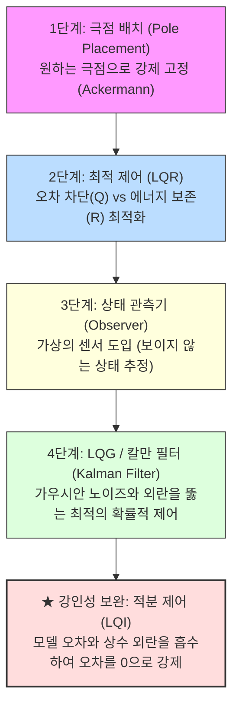

# 🚀 MATLAB State-Space Control Lab (상태 공간 제어 실습실)

이 디렉터리는 **현대 제어 이론(Modern Control Theory)**의 핵심인 **상태 공간(State-Space) 기반 제어 시스템 설계 및 시뮬레이션 자료**를 담고 있습니다. 

단순히 수식을 유도하는 수준을 넘어, **가장 직관적인 극점 배치(Pole Placement)**부터 **최적 제어(LQR)**, **관측기(Observer)**, 그리고 실제 노이즈 환경의 끝판왕인 **LQG(LQR + Kalman Filter)와 적분 제어가 포함된 강인 제어**까지 단계별(Build-up)로 발전해 나가는 실전 흐름을 MATLAB 코드와 함께 제공합니다.

---

## 📁 폴더 구조 및 파일 가이드

이 실습실의 파일들은 다음과 같은 유기적인 흐름으로 구성되어 있습니다. 각 파일을 차례대로 읽고 실행해 보며 현대 제어의 진수를 경험해 보세요.

| 파일명 (Link) | 구분 | 설명 |
| :--- | :---: | :--- |
| [**`control_demo_5_statespace.m`**](./control_demo_5_statespace.m) | **MATLAB 스크립트** | **[종합 시뮬레이션]** 4단계 빌드업(극점 배치 ➔ LQR ➔ Observer ➔ LQG) 과정을 하나의 시스템에 대해 결합하고, 각각의 제어 성능을 한눈에 시각화하여 비교해 주는 메인 스크립트입니다. |
| [**`lqr_5sec_design.m`**](./lqr_5sec_design.m) | **MATLAB 스크립트** | **[LQR 자동 튜닝]** 정착 시간 5초 이내 도달을 설계 목표로 설정하고, LQR의 상태 가중치 $Q$ 행렬을 컴퓨터가 While 루프를 통해 스스로 최적 튜닝(Auto-Tuning)해 나가는 자동화 예제입니다. |
| [**`state_space_lecture.md`**](./state_space_lecture.md) | **개념 강의 자료** | **[4단계 빌드업]** 극점 배치, LQR, 관측기 결합, LQG 제어기까지의 설계 사상과 장단점을 블록선도 및 성능 지표와 함께 단계별로 알기 쉽게 풀어쓴 통합 이론 문서입니다. |
| [**`state_feedback_integral_control.md`**](./state_feedback_integral_control.md) | **개념 강의 자료** | **[강인 제어/적분기 결합]** "상태 피드백에 목표치 추종 이득 $N$을 쓰면 끝인데, 왜 굳이 적분 제어를 더할까?"라는 질문에 대해, 실제 세계의 **모델 오차(Model Mismatch)**와 **상수 외란(Disturbance)**을 극복해 내는 원리를 수식과 블록선도로 증명합니다. |
| [**`pole_placement.md`**](./pole_placement.md) | **이론 및 심화** | 상태 피드백 제어에서 Ackermann 공식을 이용한 극점 배치법을 다루며, 특히 정상상태 오차를 제거해 주는 핵심 변수인 **사전 스케일러 $\bar{N}$ (Feedforward Gain)의 수학적 유도 과정**을 상세히 담고 있습니다. |
| [**`lqr_tutorial.md`**](./lqr_tutorial.md) | **이론 및 심화** | 최적 제어 LQR 설계 시 대각 행렬을 아무렇게나 채워 넣는 흔한 실수를 지적하고, 관측 행렬 $C$를 활용한 **정석적인 $Q$ 행렬 설계 방법($Q = q_y C^T C$)**과 가중치 튜닝 요령을 쉽게 설명합니다. |
| [**`modern_control_design_guide.md`**](./modern_control_design_guide.md) | **실무 가이드** | 정상상태 오차 제거를 위한 확장(LQI), 물리적 특성을 고려한 브라이슨 법칙(Bryson's Rule), 관측기 극점 배치 대역폭 선정 요령, 센서 노이즈 억제를 위한 칼만 필터의 가상 튜닝 등 **실무적인 제어기 설계 노하우**를 체계적으로 정리한 문서입니다. |
| [**이미지 자료 (`*.png`)**](./) | **시각 자료** | 각 제어 기법의 신호 흐름을 이해할 수 있는 고해상도 블록선도 이미지와 시뮬레이션 응답 결과 그래프들이 포함되어 있습니다. |

---

## 🛠️ 상태 공간 제어 설계의 4단계 빌드업 흐름

현대 제어는 고전 제어(전달함수)의 한계를 극복하기 위해 물리 시스템의 모든 내부 상태 변수를 수학적 도구로 정복해 나갑니다.

### 1. 극점 배치 기법 (Pole Placement)
*   **제어 법칙:** $u(t) = -Kx(t) + \bar{N}r(t)$
*   **핵심 사상:** 시스템이 가제어(Controllable)하다면, 우리가 원하는 폐루프 성능(상승시간, 오버슈트)을 만들어내는 극점으로 원하는 곳 어디로든 순간이동 시킵니다.
*   **한계:** "에너지를 얼마나 쓰든 상관없이 무조건 빠르게만 반응"하므로, 과도한 제어 입력으로 실제 구동기(Actuator)가 타버릴 위험이 있습니다.

### 2. 최적 제어 LQR (Linear Quadratic Regulator)
*   **비용 함수 최소화:** $J = \int_{0}^{\infty} (x^T Q x + u^T R u) dt$
*   **핵심 사상:** "출력 오차를 빨리 줄여라! ($Q$)"라는 지시어와 "제어 에너지를 아껴라! ($R$)"라는 벌금 규정 사이에서 완벽한 타협점을 수학적으로 조율합니다.
*   **한계:** 모터 위치, 회전 속도, 축 전류 등 시스템의 **모든 상태 변수 $x$를 완벽히 실시간 측정할 수 있다**고 가정하므로 센서 비용이 지나치게 커집니다.

### 3. 상태 관측기 (State Observer) 결합
*   **추정 방정식:** $\dot{\hat{x}} = A\hat{x} + Bu + L(y - C\hat{x})$
*   **핵심 사상:** 비싼 물리 센서를 더 다는 대신, 수학적 모델과 측정 가능한 소수의 출력 $y$를 활용해 **소프트웨어적으로 보이지 않는 상태 $\hat{x}$를 실시간 복원**하여 LQR의 피드백 게인을 공급합니다.
*   **한계:** 센서에서 유입되는 불규칙한 **노이즈(Noise)**나 예상치 못한 외부 **외란(Disturbance)**을 만나는 순간, 잘못된 상태 추정으로 제어 루프 전체가 무너질 수 있습니다.

### 4. LQG (Linear Quadratic Gaussian) / 칼만 필터
*   **확률론적 최적화:** Kalman Filter ($\hat{x}$ 최적 추정) + LQR (최적 제어) 결합
*   **핵심 사상:** 상태 천이 잡음(Process Noise, $w$)과 측정 잡음(Measurement Noise, $v$)의 가우시안 확률 특성을 기반으로, 노이즈를 스스로 필터링하는 최적 추정기(칼만 필터)를 결합하여 최상의 강인성을 발휘합니다.
*   **보완점:** 실제 현업에서는 여기에 **적분 제어기(Integrator)**를 추가로 결합하여 파라미터 오차와 상수 외란 속에서도 완벽한 무오차 추종(Zero Steady-State Error)을 구현합니다.

---

## 🚀 실습 및 실행 방법

이 디렉터리의 매트랩 예제 코드를 사용해 제어 이론을 시각적으로 확인하는 방법입니다.

### 1. 사전 준비 (Prerequisites)
*   MATLAB 설치 및 **Control System Toolbox** 라이선스 확인
*   본 디렉터리(`MATLAB/state-space/`)의 모든 파일을 한 폴더에 내려받아 다운로드합니다.

### 2. 메인 시뮬레이션 실행 (`control_demo_5_statespace.m`)
1.  MATLAB을 실행하고 작업 디렉터리를 본 폴더로 이동합니다.
2.  `control_demo_5_statespace.m` 스크립트를 열고 실행(`F5`)합니다.
3.  화면에 출력되는 **4가지 제어 기법의 통합 비교 보데 선도와 시간 응답 비교 그래프**를 확인합니다.
4.  동시에 저장되는 [`state_space_comparison.png`](./state_space_comparison.png) 파일을 통해 각 기법의 오버슈트, 상승 시간, 정착 시간 수치 비교 데이터를 대조해 봅니다.

### 3. LQR 자동 튜닝 실습 (`lqr_5sec_design.m`)
1.  `lqr_5sec_design.m` 스크립트를 실행합니다.
2.  정착 시간 스펙(5초)을 달성할 때까지 $Q$ 가중치가 증가하며 루프를 탈출하는 과정을 커맨드 창의 출력 로그로 살펴봅니다.
3.  자동으로 그려지는 시간 영역 응답 결과를 통해 LQR 최적제어 기법이 오버슈트를 극도로 억제하면서 목표 스펙을 부드럽게 만족하는 모습을 관찰합니다.

---

## 👩‍🏫 강의 및 학습 시 활용 팁

교수자 및 학습자분들께서는 아래의 흐름을 따라 토론하고 학습하면 시너지 효과를 낼 수 있습니다.

1.  **"분리 정리(Separation Principle)"의 마법 체감하기:**
    *   2단계 LQR(모든 상태 직접 측정)과 3단계 Observer 결합형 LQR(추정된 상태 피드백)의 시뮬레이션 파란 실선과 주황 점선 궤적을 비교해 보세요. **놀랍게도 두 궤적이 한 치의 오차도 없이 일치**합니다. 관측기를 결합해도 제어 성능에 간섭이 생기지 않는다는 수학적 신비를 직접 눈으로 관찰하게 합니다.
2.  **"적분 제어(Integral Control)"의 강인함 검증하기 (LQI):**
    *   [`state_feedback_integral_control.md`](./state_feedback_integral_control.md) 강의 자료를 참고하여, 매트랩 코드 내에서 일부러 실제 시스템 파라미터($a_0, a_1, b$)를 약 20% 정도 빗나가게 수정한 상태로 일반 상태 피드백을 실행해 봅니다.
    *   이때 오버슈트와 수렴값에 발생하는 잔류 오차를 확인한 뒤, 적분기를 켠 피드백 루프는 끝내 정상상태 오차를 정확히 0으로 수렴시키는 모습을 관찰하며 **내부 모델 원리(Internal Model Principle)**의 중요성을 깨닫게 합니다.
3.  **"Bryson's Rule"과 가중치 트레이드오프 이해:**
    *   LQR 설계 시 $R$ 값을 10배 키우거나 10배 줄여 보며, 모터 액추에이터의 제어 전압 크기가 어떻게 변하는지, 그리고 응답 속도에 어떤 변화가 생기는지 시뮬레이션 데이터를 바꾸어 확인해 봅니다.
