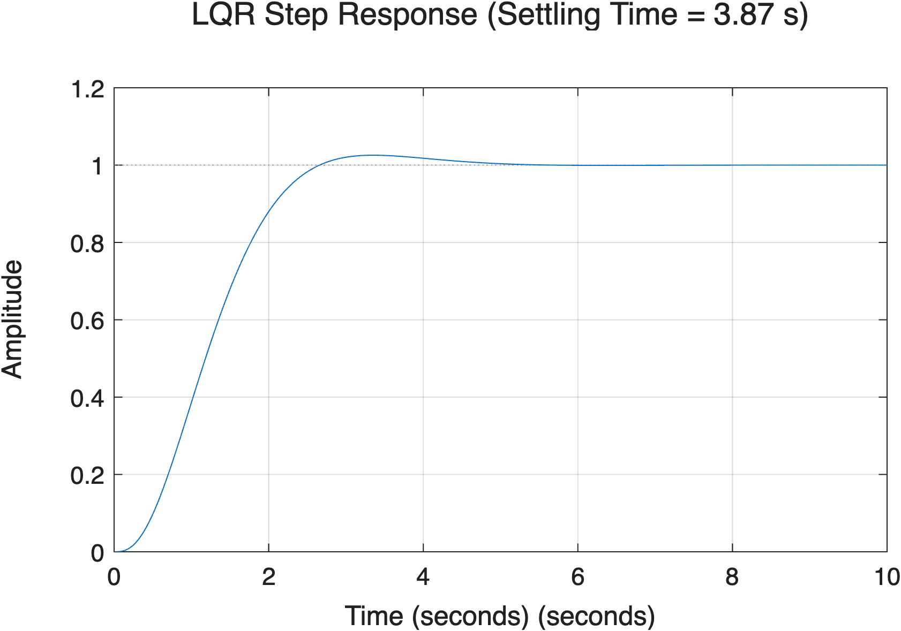

# LQR (Linear Quadratic Regulator) 쉽게 이해하기

상태 공간(State-Space) 기반 제어 설계의 꽃이라고 할 수 있는 **LQR(최적 제어기)**에 대해 알아봅시다. 앞서 우리는 `lqr_5sec_design.m` 스크립트를 통해 LQR이 어떻게 원하는 성능(정착 시간 5초 이내)을 스스로 찾아내는지 확인했습니다.

---

## 1. LQR이란 무엇인가요?

LQR은 **"가장 적은 에너지(R)를 써서 가장 빨리 목표지점(Q)에 도달하는 최적의 경로"**를 수학적으로 계산해 주는 제어 기법입니다.

다음과 같은 비용 함수(Cost Function) $J$ 를 최소화하는 제어 이득 행렬 $K$ 를 찾습니다.

$$
J = \int_0^\infty (x^T Q x + u^T R u) dt
$$

* **$Q$ 행렬 (상태 오차 페널티):** 목표 지점에서 멀어질수록 부과되는 벌금입니다. $Q$를 크게 할수록, 오차를 빨리 줄이기 위해 제어기가 아주 빠르고 강하게 반응합니다.
* **$R$ 행렬 (제어 에너지 페널티):** 모터나 액추에이터를 무리하게 사용할 때 부과되는 요금입니다. $R$을 크게 할수록, 제어기는 에너지를 아끼기 위해 아주 천천히 부드럽게 움직입니다.

> [!TIP]
> **핵심 요약:**
> 제어기 설계자는 방 안의 온도를 맞출 때, **"가스비를 아낄 것인가($R$ 크게), 아니면 무조건 빨리 따뜻해질 것인가($Q$ 크게)"** 사이의 타협점(Trade-off)만 결정해주면 됩니다. 나머지는 매트랩이 복잡한 미분방정식을 풀어서 알아서 계산해 줍니다!

---

## 2. 흔히 하는 실수: 무엇에 페널티를 줄 것인가?

처음 LQR을 배울 때 $Q = \text{diag}([10, 1, 0.1])$ 처럼 대각 행렬에 대충 숫자를 넣고 시작하는 경우가 많습니다. 하지만 이는 매우 위험할 수 있습니다!

우리가 제어하려는 시스템의 출력은 $y = Cx$ 입니다. 매트랩의 `ss(tf)` 함수로 만든 상태 변수 $x_1, x_2, x_3$ 가 우리가 직관적으로 생각하는 (위치, 속도, 가속도)와 반드시 일치하지는 않습니다. 따라서 무작정 첫 번째 상태 $x_1$ 에 페널티를 주면, 정작 중요한 출력(위치)은 놔두고 엉뚱한 내부 변수만 억제되어 제어가 극도로 느려지거나 실패할 수 있습니다.

### 💡 올바른 Q 행렬 설정법
우리의 진짜 목표는 **실제 출력 $y$의 오차**를 줄이는 것입니다. 따라서 상태 $x$가 아닌 $y^2$ 에 직접 페널티를 주어야 합니다.
수학적으로 $y = Cx$ 이므로, 페널티는 $y^2 = (Cx)^T (Cx) = x^T (C^T C) x$ 로 변환됩니다.

따라서 매트랩 코드를 짤 때는 다음과 같이 $Q$ 를 설계하는 것이 정석입니다.

```matlab
% 실제 측정/제어하려는 출력 y에 대해 가중치 q_y를 부여
Q = q_y * (C' * C); 

% (수치적 안정을 위해 대각선에 아주 작은 0.001 * eye(3) 등을 더해주면 더 좋습니다)
Q = Q + 0.001 * eye(3);
```

> [!IMPORTANT]
> LQR 설계 시 무작정 단위 행렬을 쓰지 마시고, **관측 행렬 $C$ 를 활용하여 실제 제어 목표인 출력값에 집중적으로 가중치를 구성하세요!**

---

## 3. 매트랩을 활용한 5초 달성 자동 튜닝 (Auto-Tuning)

`lqr_5sec_design.m` 예제에서는 사용자가 일일이 수치를 바꿔가며 5초 정착 시간을 찾는 대신, **컴퓨터가 직접 $Q$ 행렬의 가중치를 점진적으로 키워가며 목표치를 달성하는 반복문(While Loop)**을 사용했습니다.

```matlab
q_y = 1; % 출력에 대한 초기 가중치
ts = 100; % 초기 정착 시간 (더미 값)

while ts > 4.8  % 목표 정착 시간 5초 (안전 마진을 위해 4.8초)
    % Q 행렬 업데이트
    Q = q_y * (C' * C) + 0.001 * eye(3);
    
    % LQR 최적 게인 K 계산
    K = lqr(A, B, Q, R);
    
    % ... (폐루프 시스템 구성 후 stepinfo로 정착 시간 ts 계산) ...
    
    if ts <= 4.8
        break; % 목표(5초 이내) 달성 시 루프 탈출!
    end
    q_y = q_y * 1.5; % 가중치를 1.5배씩 증가시키며 다시 계산
end
```

이처럼 LQR의 원리를 완벽히 이해하면, 사람의 감에만 의존하던 기존의 노가다(?) 튜닝 과정을 파이썬이나 매트랩 알고리즘으로 완벽하게 자동화할 수 있습니다. 



위 그래프에서 보듯, 제어기는 아주 적절한 가중치를 스스로 찾아내 단 3.87초 만에 오버슈트 없이 목표치에 도달하는 훌륭한 성능을 보여줍니다.
