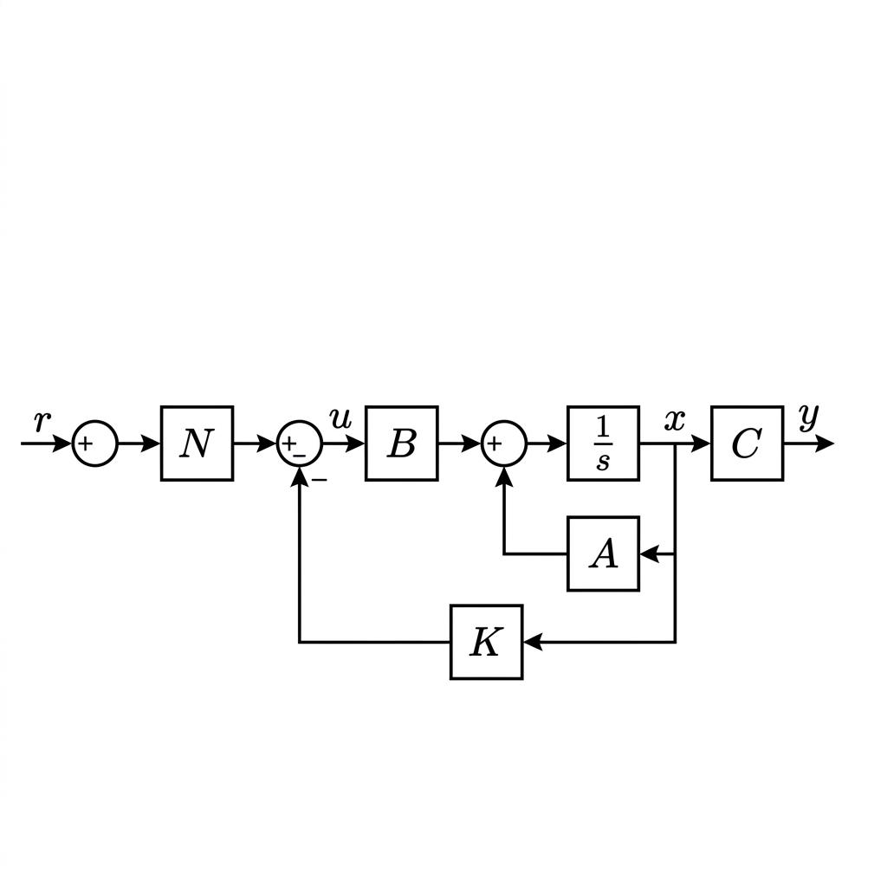

# 상태 피드백 제어와 극점 배치 (Pole Placement)

상태 공간 제어의 가장 기본이 되는 **극점 배치(Pole Placement)** 기법에 대해 알아봅니다. 
우리가 실습에 사용한 매트랩 코드(`control_demo_5_statespace.m`)의 첫 번째 챕터에 바로 이 기법이 사용되고 있습니다.

```matlab
%% 1. Pole Placement (Ackermann's Formula)
p_des = [-1+1j, -1-1j, -5];   % 1. 원하는 극점 위치 결정
K_pp = place(A, B, p_des);    % 2. 상태 피드백 게인 K 계산 (아커만 공식 원리)
N_pp = calc_Nbar(A,B,C,K_pp); % 3. 목표치 추종을 위한 스케일러 N 계산
```

---

## 1. 극점 배치(Pole Placement)의 기초
고전 제어(근궤적법 등)에서는 제어기를 달아도 극점(Poles)이 움직일 수 있는 궤적이 정해져 있었습니다. 하지만 상태 공간(State-Space) 제어에서는 시스템의 **모든 내부 상태 변수($x_1, x_2, \dots$)를 다 들여다보고 피드백**합니다.
* **장점:** 시스템이 '가제어(Controllable)'하기만 하다면, 모든 상태를 쥐고 흔들기 때문에 **원하는 곳 어디로든 시스템의 폐루프 극점을 마음대로 옮길 수 있습니다.**

---

## 2. 상태 피드백 제어 시스템 블록선도 (Block Diagram)

상태 피드백 제어 시스템($u = -Kx + \bar{N}r$)의 전체적인 흐름을 시각화한 블록선도입니다. 시스템의 내부 상태($x$)를 피드백하여 게인 $K$를 곱하고, 정상상태 오차를 제어하기 위해 목표 입력($r$)에 사전 스케일러 $\bar{N}$을 곱해 제어 입력($u$)을 생성하는 구조를 보여줍니다.



---

## 3. 핵심 변수와 공식의 의미

### 🔑 K (상태 피드백 게인 행렬, State Feedback Gain)
$$ u = -Kx $$
* **의미:** $K$는 시스템 내부의 각 상태 변수에 곱해지는 **가중치(게인)들의 모음**입니다. 자동차로 치면 위치, 속도, 가속도를 모두 따로따로 측정해서, 각각의 전용 브레이크/가속 페달($K_1, K_2, K_3$)을 밟는 것과 같습니다. 이 $K$값들을 절묘하게 조합하여 원하는 극점을 만들어냅니다.

### 📐 아커만 공식 (Ackermann's Formula)
* **의미:** 수작업으로 복잡한 연립방정식을 풀 필요 없이, **"현재 시스템 모델($A, B$)"**과 **"내가 원하는 극점 위치"**만 집어넣으면 정답 $K$를 단번에 계산해 주는 수학적 마법의 공식(Shortcut)입니다. 매트랩의 `acker`나 `place` 함수가 내부적으로 이 원리를 사용합니다.

### 🎛️ N (사전 스케일러 / $\bar{N}$, Feedforward Gain)
$$ u = -Kx + \bar{N} r $$
* **의미:** $u = -Kx$ 만 쓰면 시스템은 무조건 목표값을 0으로 멈춰 세우려는 조절기(Regulator)가 됩니다. 우리가 원하는 목표 궤적(Reference, $r$)을 따라가게 하려면 기준 입력을 넣어주어야 합니다. 이때 $\bar{N}$은 사용자의 조이스틱 입력($r$)을 시스템 특성에 맞게 적절히 **사전에 뻥튀기(혹은 축소)해 주어 정상상태 오차(Steady-State Error)를 0으로 만들어주는 영점 조율기(Pre-scaler)** 역할을 합니다.

> **💡 [심화] 피드포워드 게인 $\bar{N}$은 수식으로 어떻게 유도할까?**
> 
> $\bar{N}$을 정하는 과정은 목표 도착지(정상 상태, Steady-State)에서의 조건을 역추적하는 방식입니다.
> 
> **1. 닫힌 루프(Closed-loop) 방정식 세우기:**  
> 제어기 $u = -Kx + \bar{N}r$ 을 원래 시스템 모델 $\dot{x} = Ax + Bu$ 에 대입합니다.  
>
> $$
> \dot{x} = (A - BK)x + B\bar{N}r
> $$
> 
> **2. 정상 상태(Steady-State, $\dot{x} = 0$) 대입:**  
> 시간이 오래 지나 시스템이 완전히 안정화되면 상태의 변화량 $\dot{x}$은 0이 됩니다. 이때의 상태를 $x_{ss}$라 하면:  
>
> $$
> 0 = (A - BK)x_{ss} + B\bar{N}r
> $$
>
> $$
> x_{ss} = -(A - BK)^{-1} B\bar{N}r
> $$
> 
> *(참고: 행렬을 이항할 때는 나누기가 아니라 역행렬 $^{-1}$을 곱합니다.)*
> 
> **3. 최종 출력 $y_{ss}$와 목표치 $r$ 완벽 일치시키기:**  
> 우리가 보는 최종 출력은 $y_{ss} = C x_{ss}$ 입니다. (통상 $D=0$ 가정)  
>
> $$
> y_{ss} = \left[ -C(A - BK)^{-1} B \right] \bar{N} r
> $$
> 
> 우리의 최종 목표는 **"사용자가 입력한 목표치 $r$과 최종 출력 $y_{ss}$가 완벽히 똑같아지는 것 ($y_{ss} = r$)"** 입니다. 그러려면 대괄호 안의 덩어리와 $\bar{N}$을 곱한 값이 '숫자 1(단위 행렬)'이 되어야 합니다.
> 따라서 $\bar{N}$은 대괄호 덩어리를 통째로 역행렬(역수) 취한 값이 됩니다.
> 
> $$
> \bar{N} = \left[ -C(A - BK)^{-1} B \right]^{-1}
> $$
> 
> *(이 유도 과정을 알고 나면, 매트랩 코드의 `inv(-C*inv(A-B*K)*B)` 수식이 왜 그렇게 생겼는지 완벽하게 이해할 수 있습니다!)*

---

## 4. 극점 배치 설계 절차 (Design Procedure)

실제 상태 피드백 제어기를 설계할 때는 다음 5단계의 명확한 절차를 거칩니다.

### Step 1: 가제어성 확인 (Check Controllability)
극점을 마음대로 움직이려면 시스템이 가제어(Controllable)해야 합니다. 가제어성 행렬 $\mathcal{C} = [B, AB, A^2B \dots]$ 의 랭크(Rank)가 시스템 차수(n)와 같은지 확인합니다. 
* 매트랩: `rank(ctrb(A,B))`

### Step 2: 원하는 극점 위치 결정 (Desired Poles)
오버슈트(Overshoot)와 정착 시간(Settling Time) 등 설계 사양(Specs)에 맞춰 이상적인 폐루프 극점 위치를 역산합니다.
* **예시:** 5초 내 수렴을 원한다면 지배 극점의 실수부를 대략 $-1$ 근방으로 설정합니다. (`p_des = [-1+1j, -1-1j, -5]`)
* **설계 팁:** 제어에 큰 영향을 주지 않는 나머지 극점들은 지배 극점보다 5~10배 정도 더 왼쪽으로 멀리 버려둡니다.

### Step 3: 상태 피드백 게인 K 계산
아커만 공식(또는 매트랩 `place` 함수)을 사용하여 목표 극점을 만들어내는 $K$ 행렬을 구합니다.
* 매트랩: `K = place(A, B, p_des);`

### Step 4: 정상상태 오차 제거를 위한 N 계산
목표 궤적을 오차 없이 추종하게 하기 위해 Feedforward 게인 $\bar{N}$을 수식적으로 역산하여 곱해줍니다.
* 매트랩: `N = inv(-C * inv(A - B*K) * B);`

### Step 5: 폐루프 시뮬레이션 및 검증
설계된 $K$와 $N$을 결합하여 새로운 닫힌 루프(Closed-loop) 시스템 행렬을 만들고, 스텝 응답(Step Response)을 그려보며 처음 의도한 오버슈트와 정착 시간이 정확히 나오는지 검증합니다.
* 매트랩: `sys_cl = ss(A - B*K, B*N, C, D); step(sys_cl);`

---

> [!TIP]
> **강의 시 활용 팁**
> 고전 제어의 근궤적법에서 겪었던 튜닝의 답답함을 먼저 상기시킨 후, "이제 $K$ 행렬만 구하면 여러분이 원하는 우주 어디로든 극점을 순간이동 시킬 수 있습니다!"라고 설명하시면, 상태 피드백 제어의 강력함을 훨씬 극적으로 어필하실 수 있습니다.
