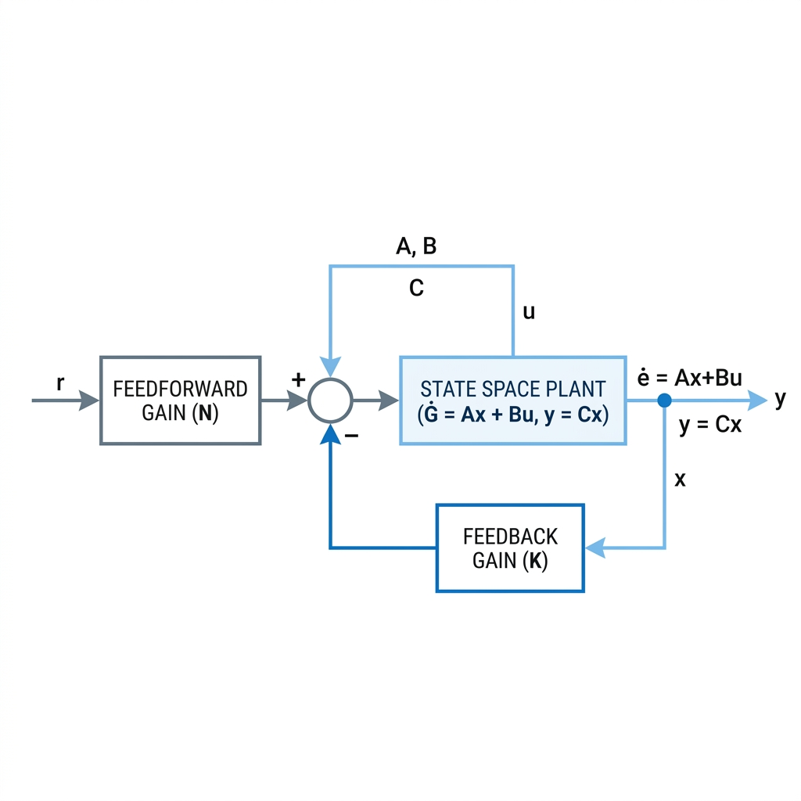
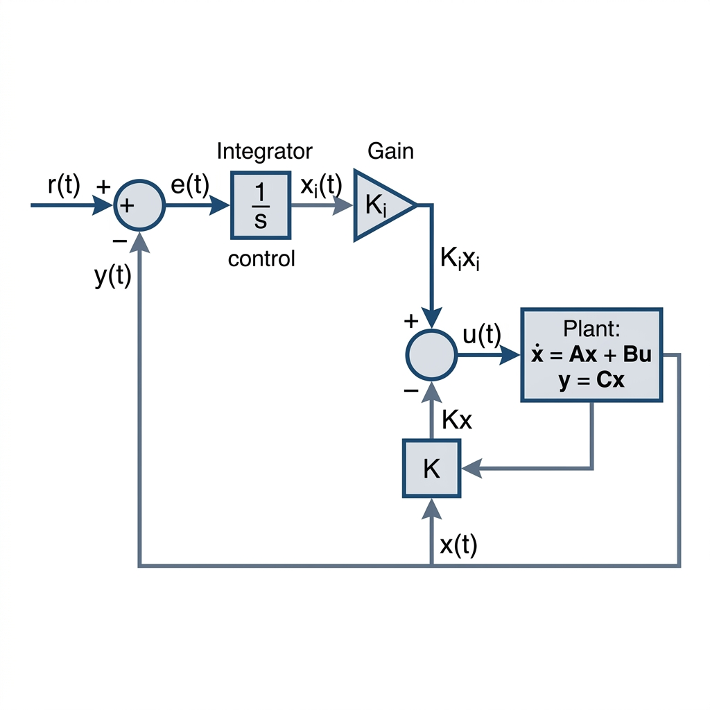

# [강의 자료] 상태 피드백 제어와 적분 제어 (State Feedback with Integral Control)
## 💡 대학생들을 위한 Step-by-Step 가이드: 왜 적분 제어가 필요할까?

자동제어를 공부하는 학생들이 가장 많이 혼동하는 질문 중 하나는 바로 이것입니다:
> **"상태변수 중 하나가 출력 $y$와 같고, 입력 $r$에 대해 일반 상태 피드백($u = -Kx + Nr$)을 사용하면 $y$가 $r$을 잘 따라가는데, 왜 굳이 복잡하게 적분 제어기(Integral Control)를 추가한 상태 피드백을 사용하는 건가요?"**

이 질문에 대한 명쾌한 답을 수식, 블록선도, 그리고 MATLAB 시뮬레이션 예제를 통해 단계별로 알아봅시다!

---

## 1. 직관적인 결론: "이상(Ideal)과 현실(Real)의 차이"

*   **이상적인 세상 (Ideal World):** 시스템의 수학적 모델($A, B, C$ 행렬)이 소수점 아래 무한대 자리까지 정확하고, 마찰이나 중력, 바람 같은 외부 외란(Disturbance)이 전혀 없는 세상입니다. 이 세상에서는 적분 제어기가 없어도 **목표치 추종 이득 $N$ (Feedforward Gain)**만 잘 설계해주면 오차 없이 $y$가 $r$을 완벽하게 따라갑니다.
*   **실제 세상 (Real World):** 
    1.  **모델 불확실성 (Model Mismatch):** 우리가 물리계를 모델링하여 얻은 $A, B, C$ 행렬은 실제 물리적 대상과 조금씩 다릅니다. (예: 모터의 저항이 온도로 인해 변함, 질량이 마모로 인해 미세하게 감소함)
    2.  **외란 (Disturbance):** 제어 대상에 예측하지 못한 상수 외란(예: 경사로를 올라갈 때의 중력, 일정한 맞바람)이 상시로 작용합니다.
    
**일반 상태 피드백은 이러한 오차와 외란에 매우 취약하며, 정상상태 오차(Steady-State Error)가 필연적으로 발생합니다.** 반면, **적분 제어(Integral Control)**를 추가하면 어떠한 모델 오차나 외란이 존재하더라도 (시스템이 안정하기만 하다면) 정상상태 오차를 **정확히 0**으로 만들어 줍니다.

---

## 2. 수식으로 이해하는 Step-by-Step 비교

동일한 선형 시변 시스템(LTI System)을 대상으로 두 제어기 구조를 수학적으로 비교해봅시다.

$$
\dot{x}(t) = Ax(t) + Bu(t)
$$
$$
y(t) = Cx(t)
$$

여기서 상태변수 중 하나가 출력 $y(t)$와 같으므로, 단일 출력(SISO) 시스템의 경우 $C = \begin{bmatrix} 1 & 0 & \dots & 0 \end{bmatrix}$과 같은 형태를 가집니다.

---

### 방식 A: 목표치 추종 이득($N$)만 사용하는 일반 상태 피드백

이 방식에서는 기준 입력 $r(t)$에 피드포워드 이득 $N$을 곱하여 제어 입력을 생성합니다.

$$
u(t) = -Kx(t) + Nr(t)
$$

이를 시스템 상태 방정식에 대입하면 폐루프(Closed-loop) 시스템은 다음과 같습니다.

$$
\dot{x}(t) = (A - BK)x(t) + BNr(t)
$$

#### 1. 이상적인 경우의 정상상태 (Ideal State)
시스템이 안정을 유지하며 정상상태(Steady-state)에 도달하면 모든 상태 변수의 미분값은 0이 됩니다 ($\dot{x}_{ss} = 0$).

$$
0 = (A - BK)x_{ss} + BNr
$$
$$
x_{ss} = -(A - BK)^{-1}BNr
$$

이때 최종 출력 $y_{ss}$는 다음과 같습니다.

$$
y_{ss} = Cx_{ss} = -C(A - BK)^{-1}BNr
$$

우리가 목표로 하는 것은 $y_{ss} = r$이 되는 것입니다. 따라서 $N$을 다음과 같이 설계하면 완벽히 추종할 수 있습니다.

$$
N = \frac{1}{-C(A - BK)^{-1}B}
$$

> **💡 학생들의 질문:** "보세요! 이렇게 $N$을 정해주면 $y$가 $r$을 똑같이 따라가잖아요?"
> **✏️ 교수님의 답변:** "맞단다. 하지만 그건 실제 시스템의 행렬이 우리가 계산한 $A, B$와 **완벽히 일치할 때만** 가능한 이야기란다."

#### 2. 현실적인 문제 1: 모델 오차 (Model Mismatch)
실제 물리 시스템의 행렬이 미세하게 변화하여 $A_{act} = A + \Delta A$, $B_{act} = B + \Delta B$ 가 되었다고 합시다. 하지만 우리는 이 변화를 모르므로 기존에 계산한 $N$을 그대로 사용합니다.

$$
y_{ss} = -C_{act}(A_{act} - B_{act}K)^{-1}B_{act}Nr \neq r
$$

분모와 분자가 서로 약분되지 않아 **정상상태 오차가 발생**하게 됩니다.

#### 3. 현실적인 문제 2: 상수 외란 (Constant Input Disturbance)
시스템에 일정한 크기의 외란 $d$가 제어 입력단에 들어오는 상황을 가정해봅시다.

$$
\dot{x} = Ax + B(u + d)
$$

여기에 $u = -Kx + Nr$을 대입하고 정상상태($\dot{x}=0$)를 구하면:

$$
0 = (A - BK)x_{ss} + B(Nr + d)
$$
$$
y_{ss} = -C(A - BK)^{-1}BNr - C(A - BK)^{-1}Bd = r - C(A - BK)^{-1}Bd \neq r
$$

외란 $d$의 영향인 $-C(A - BK)^{-1}Bd$ 만큼의 **상수 오차가 영구적으로 남게 됩니다.**

---

### 방식 B: 적분 제어를 추가한 상태 피드백 (State Feedback with Integral Control)

오차를 강제로 0으로 만들기 위해, 목표치와 실제 출력의 오차 $e(t) = r(t) - y(t)$를 누적하는 **새로운 상태변수 $x_i(t)$**를 임의로 정의하여 제어기 내부 시스템에 추가합니다.

$$
x_i(t) = \int_{0}^{t} (r(\tau) - y(\tau)) d\tau \implies \dot{x}_i(t) = r(t) - y(t) = r(t) - Cx(t)
$$

기존 물리 시스템 상태 $x(t)$와 새로운 적분기 상태 $x_i(t)$를 합쳐 **확장 상태 벡터(Augmented State Vector) $\hat{x}(t)$**를 구성합니다.

$$
\hat{x}(t) = \begin{bmatrix} x(t) \\ x_i(t) \end{bmatrix}
$$

이 확장 시스템의 상태 방정식은 다음과 같이 표현할 수 있습니다.

$$
\begin{bmatrix} \dot{x}(t) \\ \dot{x}_i(t) \end{bmatrix} = \begin{bmatrix} A & 0 \\ -C & 0 \end{bmatrix} \begin{bmatrix} x(t) \\ x_i(t) \end{bmatrix} + \begin{bmatrix} B \\ 0 \end{bmatrix} u(t) + \begin{bmatrix} 0 \\ 1 \end{bmatrix} r(t)
$$

제어 입력은 확장된 모든 상태를 피드백하여 다음과 같이 결정합니다.

$$
u(t) = -Kx(t) + K_i x_i(t) = - \begin{bmatrix} K & -K_i \end{bmatrix} \begin{bmatrix} x(t) \\ x_i(t) \end{bmatrix} = -\hat{K}\hat{x}(t)
$$

#### ✨ 물리적 파라미터와 외란에 무관하게 오차가 0이 되는 이유 (내부 모델 원리)
시스템에 모델 오차가 있든, 외란 $d$가 있든 간에, 폐루프 시스템이 안정하여 정상상태($\dot{x}_{ss} = 0, \dot{x}_{i,ss} = 0$)에 도달했다고 가정해 봅시다.

적분기 상태의 미분 방정식을 보겠습니다:
$$
\dot{x}_i(t) = r(t) - y(t)
$$

정상상태이므로 좌변은 당연히 0이 됩니다.
$$
0 = r - y_{ss} \implies y_{ss} = r
$$

**이것은 혁명적인 결과입니다!**
우리가 물리 시스템의 매개변수 $A, B$를 잘못 알고 있더라도, 입력단에 상상치 못한 일정한 외란 $d$가 유입되더라도, **폐루프 시스템이 안정하기만 하면 정상상태에서의 출력 $y_{ss}$는 한 치의 오차도 없이 $r$을 따라가게 됩니다.**

*   **어떻게 이것이 가능할까요?**
    외란 $d$가 유입되면 오차가 생기려 하고, 적분기 상태 $x_i(t)$는 오차가 미세하게라도 존재하는 한 계속해서 그 값을 누적하여 바꿉니다. 이 변하는 $x_i(t)$가 제어 입력 $u(t)$를 변화시키고, 이 입력은 **외란 $d$를 완전히 상쇄할 때까지** 멈추지 않고 스스로를 조절합니다. 
    정상상태에서 제어 입력 $u_{ss}$는 정확히 $u_{req} - d$가 되어 외란을 통째로 집어삼킵니다.

---

## 3. 블록선도로 시각적 이해하기

두 제어기 구조의 본질적인 차이를 블록선도로 직관적으로 이해해 봅시다.

### 일반 상태 피드백 (방식 A)
일반 상태 피드백은 시스템 외부에서 목표치 $r$을 단순히 상수로 스케일링($N$)하여 넣어주는 구조입니다. 시스템 내부에는 오차를 감지하고 스스로 보정하는 루프(Integrator Loop)가 없습니다.



### 적분 제어를 포함한 상태 피드백 (방식 B)
적분 제어 구조에서는 실제 출력 $y$를 목표값 $r$로 직접 끌고 와서 오차($r-y$)를 구하고, 이를 **시스템 내부 전방 경로(Forward Path) 상에 배치된 적분기**에 통과시킵니다. 이 적분기가 에너지를 축적하여 모든 불확실성과 외란을 스스로 상쇄하도록 유도합니다.



---

## 4. MATLAB 예제 코드와 시뮬레이션

백문이 불여일견! 아래의 매트랩 코드를 직접 복사해서 실행해보면, 두 방식의 차이점을 한눈에 확인해볼 수 있습니다. 

이 예제에서는 간단한 2차 시스템(예: 모터 위치 제어)을 다룹니다.
*   **공칭 모델 (제어기 설계용):** $\ddot{\theta} + 3\dot{\theta} + 2\theta = u$ (즉, $a_0 = 2, a_1 = 3, b = 1$)
*   **실제 시스템 (시뮬레이션용):** 파라미터 오차가 존재하고 ($a_0 = 1.5, b = 1.2$), $t = 5$초 시점에 $0.5$ 크기의 상수 외란(예: 역방향 토크)이 들어오는 최악의 시나리오를 설정했습니다.

이 시뮬레이션에서는 MATLAB과 **Simulink(시뮬링크)**를 연동하여 두 제어기의 물리적 거동을 모델링하고 검증합니다. 

학생들이 직접 시뮬링크 블록선도를 완성해볼 수 있도록 아래 가이드에 따라 두 개의 모델(`.slx` 파일)을 먼저 구축해 봅시다.

---

### 🛠️ [사전 준비] 시뮬링크 모델 설계 가이드 (Step-by-Step)

시뮬링크를 실행(`simulink` 입력)하고 새 모델을 생성하여 아래와 같이 블록선도를 그립니다.

#### 1) 일반 상태 피드백 모델 (`sf_normal_model.slx`)
*   **Step 블록 (`Step_r`):** 
    *   Step time = `0`, Initial value = `0`, Final value = `r` (목표값 입력)
*   **Gain 블록 (`Pre-scaler N`):** 
    *   Gain = `N_ff` (목표치 추종을 위한 스케일러)
*   **Sum 블록 (`Sum_u`):** 
    *   List of signs = `+-` (사전 스케일러 입력에서 상태 피드백 값을 감산)
*   **Sum 블록 (`Sum_dist`):** 
    *   List of signs = `++` (제어 입력 $u$에 외란 $d$를 가산)
*   **Step 블록 (`Step_dist`):** 
    *   Step time = `5`, Initial value = `0`, Final value = `dist_val` (5초 시점에 상수 외란 인가)
*   **State-Space 블록 (`Plant_SS`):** 
    *   Continuous-time State-Space 블록을 추가하고 파라미터를 다음과 같이 입력합니다.
        *   $A$ = `A_act`, $B$ = `B_act`, $C$ = `C_act`, $D$ = `0`
*   **Gain 블록 (`Feedback_K`):** 
    *   Gain = `K_sf`
    *   **⚠️ 중요 설정:** Gain 블록을 더블 클릭한 후 **Multiplication** 옵션을 `Matrix(u*K)`로 반드시 변경해 주어야 행렬 곱셉이 올바르게 수행됩니다. (기본값은 원소별 곱셈인 Element-wise임)
    *   State-Space 블록의 상태 출력 $x(t)$를 이 Gain 블록에 입력한 뒤, 그 출력을 `Sum_u` 블록의 마이너스(`-`) 단자에 연결합니다.
*   **To Workspace 블록 (`yout`):**
    *   State-Space 블록의 최종 출력 $y(t)$를 To Workspace 블록에 연결하여 데이터를 MATLAB으로 보냅니다.
    *   Save format = `Timeseries`, Variable name = `yout`

#### 2) 적분 제어 결합 상태 피드백 모델 (`sf_integral_model.slx`)
*   **오차 계산 Sum 블록 (`Sum_err`):**
    *   Step 블록(`Step_r`)의 목표값 $r$에서 실제 출력 $y$를 감산하기 위해 List of signs = `+-` 설정
*   **Integrator 블록 (`Integrator`):** 
    *   오차 신호($r-y$)를 연속 적분하여 적분 상태 $x_i(t)$를 생성
*   **Gain 블록 (`Gain_Ki`):** 
    *   Gain = `Ki` (적분 제어 게인)
*   **제어 입력 Sum 블록 (`Sum_u`):** 
    *   List of signs = `+-` (적분 제어 입력 $K_i x_i$에서 상태 피드백 $Kx$를 감산)
*   **State-Space 블록 (`Plant_SS`):**
    *   상태 변수 피드백을 위해 State-Space 블록의 파라미터를 아래와 같이 입력하여 상태 $x$ 전체를 출력으로 내보냅니다.
        *   $A$ = `A_act`, $B$ = `B_act`, $C$ = `eye(2)`, $D$ = `[0;0]`
*   **Gain 블록 (`Feedback_K`):** 
    *   Gain = `K`, Multiplication = `Matrix(u*K)`
    *   State-Space 블록의 2차원 출력(상태 $x$)을 이 블록에 입력하여 피드백 값 $Kx$를 만들고, `Sum_u` 블록의 마이너스 단자에 연결합니다.
*   **Gain 블록 (`C_matrix_gain`):**
    *   Gain = `C_act`, Multiplication = `Matrix(u*K)`
    *   2차원 상태 변수 $x(t)$에서 최종 출력 $y(t) = Cx(t)$를 뽑아내기 위해 사용합니다. 이 블록의 출력을 `Sum_err` 블록의 마이너스 단자와 To Workspace 블록(`yout`)에 연결합니다.
*   **To Workspace 블록 (`yout`):** 
    *   Save format = `Timeseries`, Variable name = `yout`

---

### 💻 MATLAB & Simulink 연동 실행 코드

아래의 매트랩 코드(`state_feedback_simulink_run.m`)를 작성하고 실행하면, 공칭 모델 기반으로 상태 피드백 및 적분 제어기를 자동 설계한 뒤 **시뮬링크 모델을 백그라운드에서 실행(`sim` 명령어)하고 시뮬레이션 데이터를 받아와 그래프로 비교**해 줍니다. 

*(만약 시뮬링크 모델 파일이 없거나 생성하지 않은 상태라면, 오류를 방지하고 시각적 확인을 할 수 있도록 `ode45` 기반의 수치 연산 시뮬레이션으로 자동 대체하여 그래프를 렌더링합니다.)*

```matlab
%% 상태 피드백 제어 vs 적분 제어 시뮬링크 연동 시뮬레이션
% 이 스크립트는 모델 불확실성과 외란이 있을 때 상태 피드백 및 적분 제어기의 성능을 비교합니다.

clear; clc; close all;

%% 1. 시스템 파라미터 정의
% 제어기 설계자가 알고 있는 설계용 '공칭 모델' (Nominal Model)
a0_nom = 2; a1_nom = 3; b_nom = 1;
A_nom = [0 1; -a0_nom -a1_nom];
B_nom = [0; b_nom];
C_nom = [1 0]; % 출력 y = x1 (위치)
D_nom = 0;

% 시뮬레이션에 사용할 실제 '물리 시스템' (Actual Model - 파라미터 오차 반영)
a0_act = 1.5; a1_act = 2.5; b_act = 1.2;
A_act = [0 1; -a0_act -a1_act];
B_act = [0; b_act];
C_act = [1 0];
D_act = 0;

% 목표값 및 외란 조건 (시뮬링크 Step 블록에서 파라미터로 참조)
r = 1.0;          % 목표값 (Step Input)
dist_val = 0.5;   % t = 5초에 인가될 입력단 상수 외란

%% 2. 제어기 설계 (극 배치법, Pole Placement)
% --- 방식 A: 일반 상태 피드백 ---
poles_sf = [-3, -4]; % 원하는 폐루프 극점
K_sf = acker(A_nom, B_nom, poles_sf);
% 공칭 모델 기반 피드포워드 이득 N 계산
N_ff = 1 / (-C_nom * ((A_nom - B_nom * K_sf) \ B_nom));

% --- 방식 B: 적분 제어가 포함된 상태 피드백 ---
% 확장 시스템 행렬 정의 (3차 시스템)
A_aug = [A_nom, zeros(2,1); -C_nom, 0];
B_aug = [B_nom; 0];
poles_aug = [-3, -4, -5]; % 원하는 확장 폐루프 극점
K_aug = acker(A_aug, B_aug, poles_aug);

K = K_aug(1:2);
Ki = -K_aug(3); % u = -K*x + Ki*xi

%% 3. 시뮬링크 모델 실행
disp('시뮬링크 모델을 시뮬레이션하는 중...');

% Simulink 1: 일반 상태 피드백 모델 실행
try
    out_sf = sim('sf_normal_model');
    t_sf = out_sf.tout;
    y_sf = out_sf.yout;
    disp('일반 상태 피드백 시뮬링크 시뮬레이션 완료.');
catch
    warning('sf_normal_model.slx 파일이 없습니다. 수치 시뮬레이션(ode45)으로 대체합니다.');
    tspan = 0:0.01:10;
    x0_sf = [0; 0];
    [t_sf, x_sf] = ode45(@(t, x) [0 1; -a0_act -a1_act]*x + [0; b_act]*(-K_sf*x + N_ff*r + (t>=5)*dist_val), tspan, x0_sf);
    y_sf = x_sf(:, 1);
end

% Simulink 2: 적분 제어 결합 상태 피드백 모델 실행
try
    out_int = sim('sf_integral_model');
    t_int = out_int.tout;
    y_int = out_int.yout;
    disp('적분 피드백 시뮬링크 시뮬레이션 완료.');
catch
    warning('sf_integral_model.slx 파일이 없습니다. 수치 시뮬레이션(ode45)으로 대체합니다.');
    tspan = 0:0.01:10;
    x0_int = [0; 0; 0];
    [t_int, x_int] = ode45(@(t, x_aug) [ [0 1; -a0_act -a1_act], [0; 0]; -C_act, 0]*x_aug + [0; b_act; 0]*(-K*x_aug(1:2) + Ki*x_aug(3) + (t>=5)*dist_val) + [0; 0; 1]*r, tspan, x0_int);
    y_int = x_int(:, 1);
end

%% 4. 결과 시각화
figure('Position', [100, 100, 900, 500]);
plot(t_sf, y_sf, 'r--', 'LineWidth', 2.0); hold on;
plot(t_int, y_int, 'b-', 'LineWidth', 2.0);
yline(r, 'k:', 'LineWidth', 1.5);
xline(5, 'r:', 't = 5s (외란 유입)', 'LabelVerticalAlignment', 'bottom', 'LineWidth', 1.2);

grid on;
xlabel('시간 (Time, s)', 'FontSize', 12);
ylabel('출력 (Output, y)', 'FontSize', 12);
title('시뮬링크 연동: 모델 불확실성 및 외란 조건 제어 성능 비교', 'FontSize', 14);
legend('일반 상태 피드백 (u = -Kx + Nr)', '적분 피드백 (u = -Kx + Ki*xi)', '목표값 (r)', 'Location', 'SouthEast');
```

---

## 5. 시뮬레이션 그래프 해석 (시각적 설명)

위의 MATLAB 시뮬레이션을 실행하면 다음과 같은 극명한 차이를 볼 수 있습니다:

1.  **초기 추종 (0 ~ 5초 영역 - 모델 오차 반영):**
    *   **일반 상태 피드백 (빨간 점선):** 공칭 모델을 기반으로 계산한 피드포워드 이득 $N$이 실제 시스템과 맞지 않기 때문에, 외란이 없음에도 불구하고 출력이 목표값 $1.0$에 완벽히 도달하지 못하고 살짝 빗나가게 됩니다.
    *   **적분 피드백 (파란 실선):** 모델 오차가 있음에도 불구하고 과도 응답을 거쳐 정확하게 $1.0$을 완벽하게 수렴해 나갑니다.
2.  **외란 발생 이후 (5초 이후 영역):**
    *   **일반 상태 피드백 (빨간 점선):** $5$초 시점에 유입된 상수 외란 $d=0.5$를 전혀 상쇄하지 못해, 출력이 목표값에서 더 큰 정상상태 오차를 보이며 아래로 푹 떨어진 채 회복하지 못합니다.
    *   **적분 피드백 (파란 실선):** 외란 유입 순간 출력이 잠시 흔들리지만, 오차가 발생하자마자 적분 상태 $x_i$가 외란의 양만큼 제어 출력을 신속하게 자동으로 보정하여 출력을 다시 목표값 $1.0$으로 복원시킵니다.

---

## 6. 한 줄 요약 정리

> **"수학 모델의 한계를 극복하고 예측할 수 없는 외풍(외란) 속에서도 제어 목표를 완벽히 달성하기 위해 우리는 적분 제어를 결합한 상태 피드백을 필수적으로 사용합니다."**
