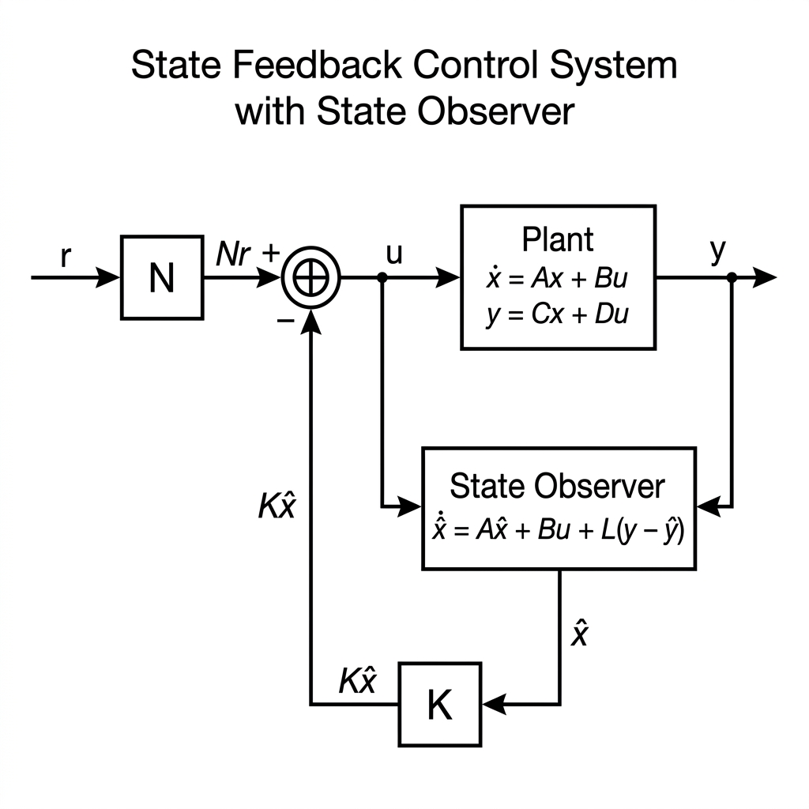
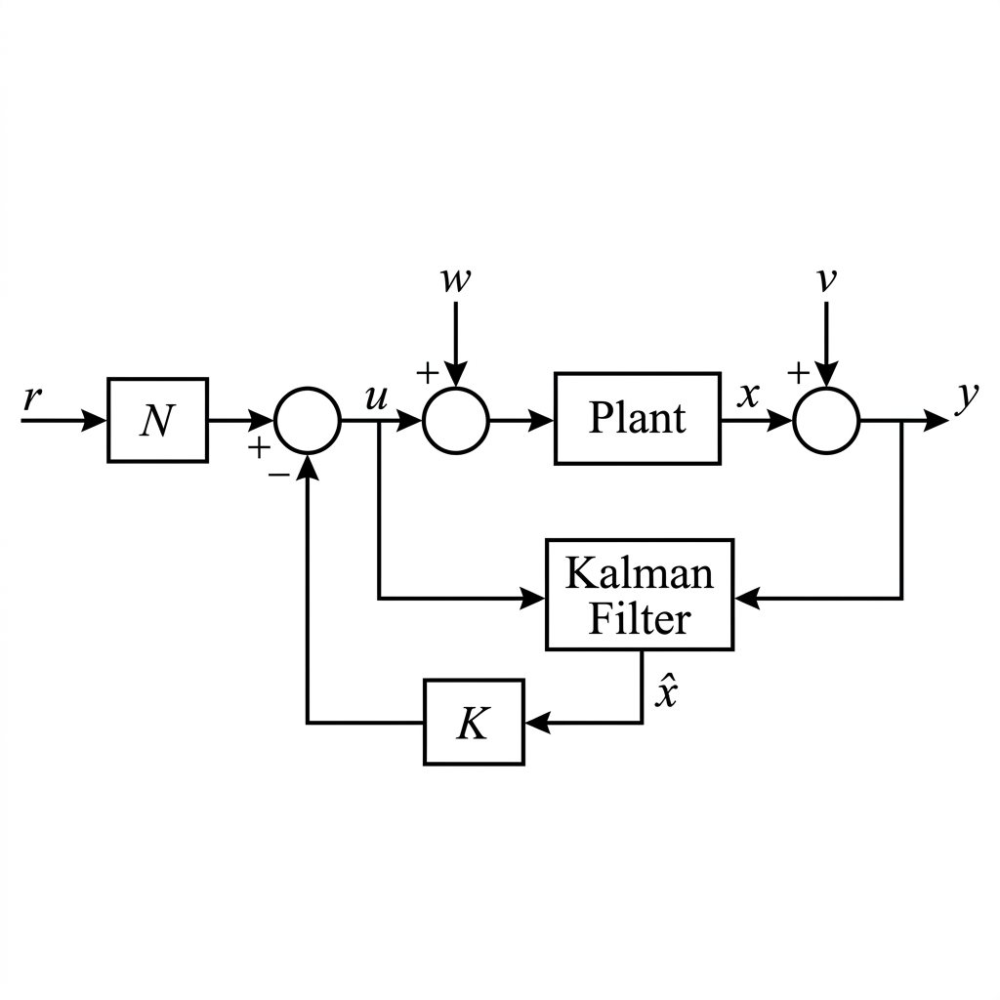
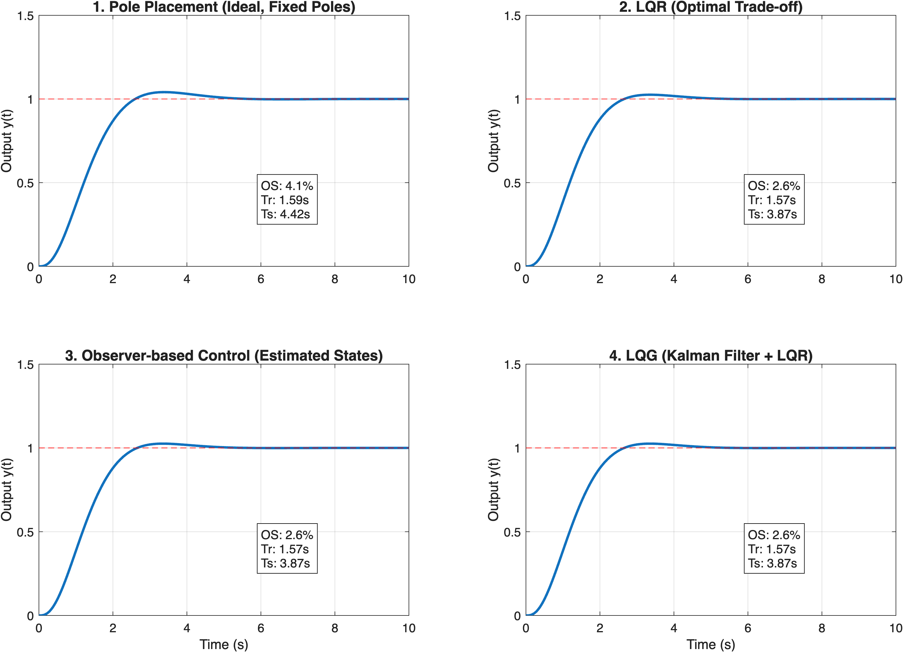

# 상태 공간 제어 기법: 쉬운 방법부터 끝판왕까지 (빌드업 과정)

고전 제어(전달함수)에서 한계를 느끼고 상태 공간(State-Space) 모델로 넘어왔을 때, 우리는 시스템의 모든 내부 상태 $x(t)$ 를 활용하여 제어기를 설계할 수 있습니다. 

이번 단원에서는 가장 기초적인 극점 배치(Pole Placement)부터 시작하여, 현실의 센서 노이즈까지 모두 고려하는 가장 완벽한 형태인 LQG 제어기까지 4단계로 빌드업하며 발전해 나갑니다.

---

## 1단계: 극점 배치 기법 (Pole Placement)

가장 기초적이고 직관적인 방법입니다. 우리가 원하는 시스템의 반응 속도와 오버슈트를 결정하는 **"폐루프 극점(Closed-loop Poles)의 위치"를 사용자가 마음대로 정해버리는 기법**입니다. (Ackermann's Formula 이용)

$$
u = -Kx
$$

### 📊 상태 피드백 제어 시스템 블록선도 (Block Diagram)

이득 $K$와 사전 스케일러 $\bar{N}$을 활용하는 상태 피드백 제어 시스템의 전체적인 신호 흐름을 나타낸 블록선도입니다.

* **상태 피드백 제어 구조:** 상태 변수 $x$를 전부 피드백하여 게인 $K$를 곱하고(State Feedback), 정상 상태 오차를 제거하기 위해 목표 입력 $r$에 사전 스케일러 $\bar{N}$을 곱해 제어 입력 $u$를 만들어냅니다.

* **장점:** 이론적으로 시스템이 가제어(Controllable)하다면, 극점을 원하는 어떤 곳이든 100% 보낼 수 있습니다. 수학적으로 매우 쉽고 직관적입니다.
* **단점 (한계):** "그럼 도대체 극점을 어디에 두는 것이 가장 좋은가?"에 대한 답을 주지 못합니다. 극점을 너무 원점에서 멀리(빠르게) 배치하면, 액추에이터가 감당할 수 없을 정도로 거대한 제어 입력(에너지)이 필요해져 모터가 타버릴 수 있습니다.

---

## 2단계: 최적 제어 LQR (Linear Quadratic Regulator)

극점 배치의 한계를 극복하기 위해 등장했습니다. 극점을 임의로 지정하는 대신, **"목표 지점까지의 오차를 빨리 줄이는 것($Q$)"** 과 **"제어 에너지를 아끼는 것($R$)"** 사이의 타협점(Trade-off)을 찾아주는 최적화 기법입니다.

다음과 같은 비용 함수(Cost Function) $J$를 최소화하는 이득 행렬 $K$를 수학적으로 찾아냅니다.

$$
J = \int_0^\infty (x^T Q x + u^T R u) dt
$$

### 📊 최적 제어 LQR 시스템 블록선도 (Block Diagram)

LQR 제어기는 극점 배치 기법과 완전히 동일한 **상태 피드백 제어 시스템 구조**를 공유하며, 다만 피드백 게인 행렬 $K$를 비용 함수 $J$를 최소화하는 방향으로 최적 설계한다는 점만 다릅니다.

* **최적 제어 루프:** 모든 상태 변수 $x$를 완벽히 실시간 측정할 수 있다는 전제 하에, 시스템 행렬 $A, B$와 설계자가 튜닝한 가중치 행렬 $Q, R$로부터 도출된 최적 피드백 게인 $K$를 각 상태에 곱해 상태 피드백 루프를 형성합니다.

* **장점:** 수학적으로 가장 완벽한 최적의 이득 $K$를 계산해냅니다. 에너지를 고려하므로 매우 현실적입니다.
* **단점 (한계):** LQR은 시스템의 **모든 내부 상태 $x$를 센서로 직접 측정할 수 있다**고 가정합니다. 현실에서는 위치만 측정 가능할 뿐, 속도나 가속도 등을 모두 측정하는 것은 비용적으로나 물리적으로 불가능에 가깝습니다.

---

## 3단계: 상태 관측기 (State Observer) 결합

모든 상태를 측정할 수 없는 LQR의 현실적 한계를 극복하기 위해 **가상의 센서(Observer)** 를 도입합니다. 측정 가능한 출력 $y$와 시스템의 수학적 모델을 비교하여, 현재 측정 불가능한 내부 상태 $\hat{x}$를 실시간으로 추정(Estimate)해냅니다.

대표적인 Luenberger Observer의 수식은 다음과 같습니다.

$$
\dot{\hat{x}} = A\hat{x} + Bu + L(y - C\hat{x})
$$

### 📊 LQR + 상태 관측기 결합 시스템 블록선도 (Block Diagram)

모든 상태변수를 직접 측정하지 않고, 상태 관측기(State Observer)를 이용해 추정한 상태 $\hat{x}$를 LQR 게인 $K$로 피드백하는 시스템의 구조입니다.

* **관측기 기반 상태 피드백:** Plant의 입력 $u$와 출력 $y$를 동시에 상태 관측기에 집어넣어 상태 추정치 $\hat{x}$를 실시간으로 유도하고, 이 $\hat{x}$에 제어 게인 $K$를 곱해 제어 루프를 닫습니다.

* **장점:** 비싼 센서를 추가로 달지 않고도, 소프트웨어적으로 모든 상태를 알아내어 LQR 제어기를 그대로 써먹을 수 있습니다. (분리 정리, Separation Principle)
* **단점 (한계):** 센서에서 들어오는 값 $y$에 **노이즈(Noise)** 가 심하거나, 외부에 예상치 못한 외란이 있으면 관측기가 엉뚱한 값을 추정하게 되어 제어가 불안정해집니다.

---

## 4단계: LQG (Linear Quadratic Gaussian) / 칼만 필터(Kalman Filter)

노이즈와 외란이 가득한 최악의 현실 세계를 위한 "끝판왕" 제어기입니다.
3단계의 관측기 대신, **확률 통계(Gaussian)를 기반으로 노이즈를 스스로 걸러내는 칼만 필터(Kalman Filter)** 를 사용하여 상태를 추정합니다. 

즉, **Kalman Filter (최적 상태 추정) + LQR (최적 제어) = LQG** 가 됩니다.

### 📊 LQG 제어 시스템 블록선도 (Block Diagram)

시스템의 상태 천이 노이즈(Process Noise, $w$)와 센서 측정 노이즈(Measurement Noise, $v$)가 혼재된 가우시안 노이즈 환경에서 칼만 필터(Kalman Filter)를 상태 추정기로 활용하는 LQG 제어 구조입니다.

* **확률적 최적 제어 구조:** 불확실한 노이즈 $w$와 $v$에 노출된 Plant의 출력 $y$를 칼만 필터를 통과시켜 가장 노이즈가 제거된 최적의 상태 추정값 $\hat{x}$를 구하고, 이를 LQR 제어 이득 $K$와 결합해 최상의 제어 성능을 이끌어냅니다.

* **장점:** 센서 노이즈와 시스템 외란이 존재하는 실제 산업 현장(항공우주, 자율주행, 정밀 모터 제어 등)에서 구현할 수 있는 가장 수학적으로 완벽한 선형 제어기입니다.
* **단점:** 모델이 정확해야 하며, 노이즈의 통계적 특성(공분산 행렬 $Q_n, R_n$)을 설계자가 직접 정확히 튜닝해야 하는 까다로움이 있습니다.

---

## 📊 시뮬레이션 비교 결과

작성된 매트랩 스크립트 `control_demo_5_statespace.m`을 실행한 결과입니다. 

### 📈 성능 지표 (Performance Metrics)
아래 표는 각 제어 기법의 주요 시간 영역(Time-domain) 성능 지표를 비교한 결과입니다.

| 제어 기법 (Method) | 오버슈트 (Overshoot) | 상승 시간 (Rise Time) | 정착 시간 (Settling Time) | 비고 |
| :--- | :---: | :---: | :---: | :--- |
| **1. Pole Placement** | 4.10% | 1.59초 | 4.42초 | 극점을 임의로 고정하여 에너지 소모를 고려하지 않음 |
| **2. LQR** | 2.56% | 1.57초 | 3.87초 | 최적화 튜닝으로 가장 부드럽고 이상적인 궤적 생성 |
| **3. Observer** | 2.56% | 1.57초 | 3.87초 | 상태 추정기를 결합해도 LQR 원본과 동일한 성능 유지 |
| **4. LQG** | 2.56% | 1.57초 | 3.87초 | 칼만 필터를 적용하여 불확실성 속에서도 이상적인 성능 복원 |

> [!TIP]
> **강의 시 활용 팁**
> * 표의 결과를 짚어주시며, LQR(2번)이 극점 배치(1번)보다 오버슈트가 현저히 낮으면서도 정착 시간은 더 빠르다는 점(최적 제어의 우수성)을 강조해 주세요.
> * 3번과 4번 결과를 통해, 센서가 하나뿐이어도 Observer와 Kalman Filter로 '보이지 않는 상태'를 완벽히 추정하여 성능 저하 없이 제어할 수 있다는 **'현대 제어의 마법'**을 학생들에게 어필해 주시면 좋습니다!
