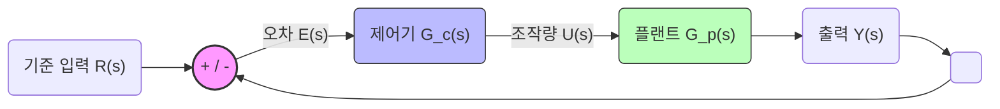
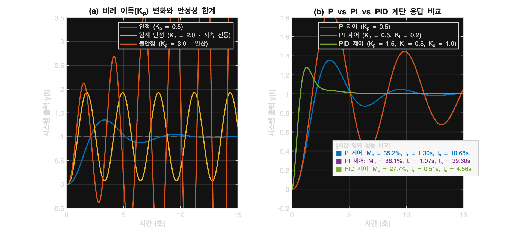
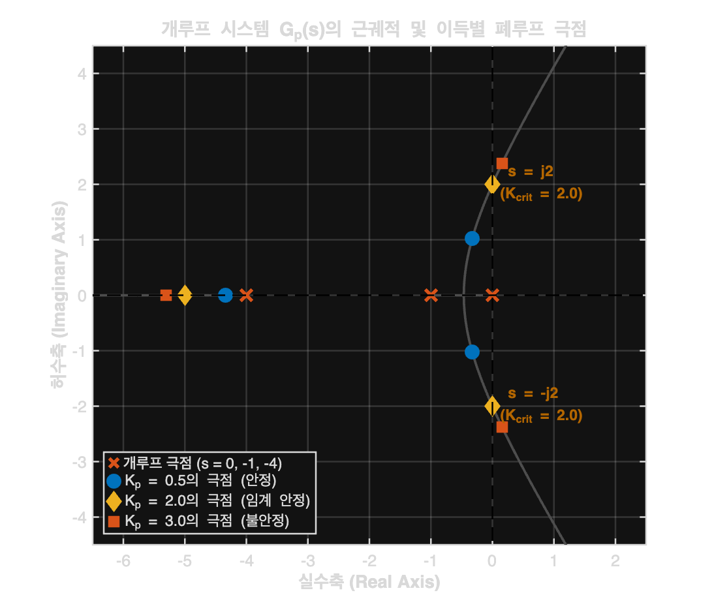
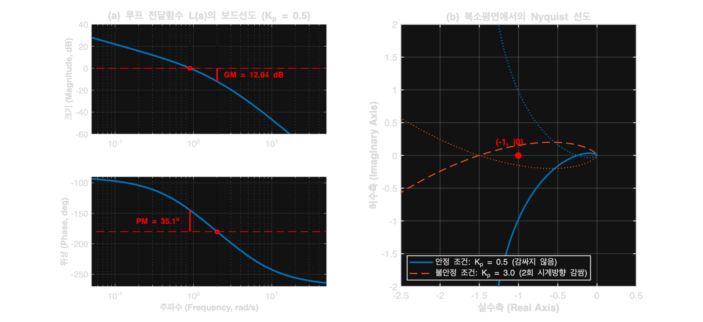
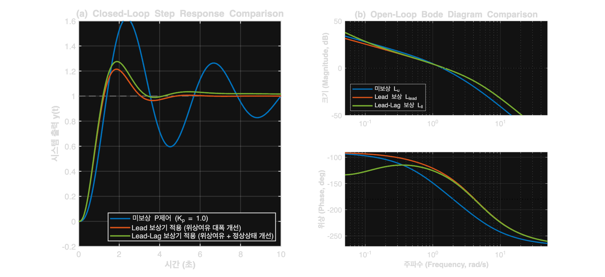

# [Lecture Slides] 자동제어 핵심이론: 피드백, PID, 주파수 해석 및 Lead-Lag 보상기 설계

---

## Slide 1: 타이틀 (Title)
### **자동제어 핵심이론 및 제어기 설계**
#### 피드백 제어, PID, 주파수 안정성 해석, 그리고 Lead-Lag 보상기 설계

* **강사**: 김동한 교수
* **강의 주제**: 
  1. 피드백 루프의 기본 구성 및 블록도
  2. 시간 영역 성능 지표 (Step & Ramp) 및 PID 제어
  3. 주파수 영역 안정성 해석 (근궤적, Bode, Nyquist)
  4. 주파수 영역 기반 Lead-Lag 보상기 설계 및 성능 개선

---

## Slide 2: 피드백 제어 시스템의 구성 (Feedback Loop)
### **왜 피드백 제어인가?**

* **개루프(Open-loop) 제어의 한계**: 불확실성, 외란(Disturbance), 파라미터 변동에 대처 불가능.
* **폐루프(Closed-loop) 제어의 장점**:
  * 현재 출력 $Y(s)$를 피드백 센서로 계측하여 기준 입력 $R(s)$와 비교.
  * 실시간으로 계산되는 **제어 오차 $E(s) = R(s) - Y(s)$**를 0으로 수렴시키는 강인한 제어 달성.

---

## Slide 3: 공통 학습 대상 시스템 (Our Benchmark Plant)
### **3차 선형 동적 시스템 (3rd-Order Plant)**

$$\mathbf{G_p(s) = \frac{10}{s(s+1)(s+4)} = \frac{10}{s^3 + 5s^2 + 4s}}$$

> [!NOTE]
> **본 플랜트의 물리적 구성 특징:**
> 1. **적분기 ($1/s$) 포함**: 원점에 극점 존재. 개루프 상태에서 마진 안정. 
> 2. **지연 극점들 ($s = -1, -4$)**: 시스템 속도 및 감쇠에 영향을 주는 관성/감쇠 요소를 표현.
> 3. **안정성 한계 존재**: 이득(Gain)이 커짐에 따라 쉽게 진동하고 불안정해지는 특성을 가짐.

---

## Slide 4: 시간 영역 성능 평가 지표 (Time-Domain Metrics)
### **제어 응답을 정량적으로 평가하는 4가지 기준**

* **상승 시간 (Rise Time, $t_r$)**: 응답이 최종 정상상태 값의 10%에서 90%까지 도달하는 속도. (응답의 신속성)
* **최대 오버슈트 (Peak Overshoot, $M_p$)**: 과도 상태에서 출력이 목표값 대비 초과한 최대 비율(%). (제어 안정성 및 감쇠)
* **정착 시간 (Settling Time, $t_s$)**: 응답이 최종 목표치 부근 오차 범위($\pm 2\%$) 내로 완전히 수렴하는 데 걸리는 시간. (진동 감쇄 속도)
* **정상상태 오차 (Steady-state Error, $e_{ss}$)**: 시간이 무한대로 흐를 때 목표값과 출력의 수치적 오차 ($t \to \infty$).
  * 계단 입력(Step Input)에 대한 오차 $e_{ss, step}$
  * 경사 입력(Ramp Input)에 대한 오차 $e_{ss, ramp}$

---

## Slide 5: 비례(P) 제어와 안정성 한계 (Proportional Control)
### **이득 $K_p$가 증가하면 시스템은 어떻게 될까?**

* 특성 방정식: $s^3 + 5s^2 + 4s + 10K_p = 0$
* **루스-허위츠(Routh-Hurwitz) 안정성 분석 결과**:
  $$\begin{array}{c|cc} s^3 & 1 & 4 \\ s^2 & 5 & 10K_p \\ s^1 & \mathbf{4 - 2K_p} & 0 \\ s^0 & \mathbf{10K_p} & \end{array}$$

> [!WARNING]
> * **$K_p < 2.0$**: 안정(Stable) - 오버슈트가 있으나 서서히 수렴.
> * **$K_p = 2.0$**: 임계 안정(Marginally Stable) - **$s = \pm j2$ 허수축 극점 위치, 지속 진동**.
> * **$K_p > 2.0$**: 불안정(Unstable) - 우반평면(RHP) 극점 진입, 지수적으로 발산.

---

## Slide 6: PI 제어와 PID 제어 (PI & PID Control)
### **적분(I)과 미분(D) 이득의 강력한 효과**

* **PI 제어기** ($G_c(s) = K_p + \frac{K_i}{s}$):
  * **적분기 추가 $\to$ 시스템 타입을 1단계 업그레이드 (Type 2)**
  * **효과**: 경사(Ramp) 입력에 대한 정상상태 오차를 **이론적으로 0**으로 만듦.
  * **단점**: 위상 지연으로 인해 오버슈트가 극도로 커지고 정착 시간이 길어짐.
* **PID 제어기** ($G_c(s) = K_p + \frac{K_i}{s} + K_d s$):
  * **미분기 추가 $\to$ 좌반평면(LHP)에 영점(Zero) 배치**
  * **효과**: 제어 루프에 강력한 댐핑(Damping) 부여. **오버슈트 전폭 억제 및 정착 시간 단축**.

---

## Slide 7: P vs PI vs PID 시뮬레이션 결과
### **시간 영역 과도 및 정상상태 응답 비교**

#### 📊 수치 비교표
| 제어기 방식 | 상승 시간 ($t_r$) | 최대 오버슈트 ($M_p$) | 정착 시간 ($t_s$) | 경사(Ramp) 정상상태 오차 |
| :--- | :---: | :---: | :---: | :---: |
| **P 제어** ($K_p = 0.5$) | $1.30\text{ s}$ | $35.25\%$ | $10.68\text{ s}$ | $0.80$ |
| **PI 제어** ($K_p = 0.5, K_i = 0.2$) | $1.07\text{ s}$ | $88.14\%$ | $39.60\text{ s}$ | **$0.00$ (수렴)** |
| **PID 제어** ($K_p = 1.5, K_i = 0.5, K_d = 1.0$) | **$0.51\text{ s}$** | **$27.73\%$** | **$4.56\text{ s}$** | **$0.00$ (즉시제거)** |

---

## Slide 8: 주파수 영역 성능 평가 지표 (Frequency-Domain Metrics)
### **개루프 주파수 응답으로 예측하는 폐루프 거동**

* **이득 여유 (Gain Margin, GM)**: 
  * 개루프 위상이 $-180^\circ$가 될 때 대수 크기 $|G(j\omega)|$가 $0\text{ dB}$로부터 떨어진 양. (시스템이 얼마나 추가 이득을 버틸 수 있는가)
* **위상 여유 (Phase Margin, PM)**:
  * 개루프 크기가 $0\text{ dB}$ ($1$)가 될 때 위상각이 $-180^\circ$에 대해 가지는 추가적인 주상각 여유. (시스템 댐핑 및 과도 거동과 비례)
* **공진 피크 (Resonant Peak, $M_{p\omega}$)**:
  * 폐루프 크기 응답의 최대 피크치. 시간 영역의 최대 오버슈트 $M_p$와 직접적으로 비례.
* **대역폭 (Bandwidth, $\omega_{BW}$)**:
  * 폐루프 응답이 저주파 대비 $-3\text{ dB}$로 감소하는 주파수. (제어 반응 속도 및 고주파 노이즈 필터링 능력 결정)

---

## Slide 9: 근궤적법 분석 (Root Locus)
### **S-평면상에서 극점의 이동 경로**

* **출발**: 개루프 극점 $s = 0, -1, -4$.
* **분기**: 실수축 상 $s=0$과 $s=-1$의 두 극점이 충돌하여 복소 평면으로 분기.
* **허수축 교차**: 이득 $K$가 커지며 $s = \pm j2$ (임계이득 $K=2.0$)에서 허수축을 뚫고 우반평면(RHP)으로 이동.
  * **$K > 2.0$**: 극점이 RHP에 도달하며 제어 루프 불안정.

---

## Slide 10: 주파수 안정성 여유 분석 (Bode & Nyquist Plots)
### **Bode 선도와 Nyquist 선도가 들려주는 안정성 정보**

* **Bode 선도 ($K_p = 0.5$ 시):**
  * 위상교차주파수 $\omega_{pc} = 2.0\text{ rad/s}$에서 이득 여유 **$GM = 12.04\text{ dB}$**. (4배까지 이득 증가 가능)
  * 이득교차주파수 $\omega_{gc} = 0.90\text{ rad/s}$에서 위상 여유 **$PM = 35.14^\circ$**.
* **Nyquist 판별법 ($Z = N + P$):**
  * 개루프 RHP 극점 수 $P=0$이므로, 임계점 $(-1, j0)$을 감싸는 횟수 $N=0$이어야 안정.
  * **$K_p = 0.5$**: $(-1, j0)$의 우측 통과 ($N=0 \to$ 안정).
  * **$K_p = 3.0$**: $(-1, j0)$을 시계방향으로 2회 감싸며 통과 ($N=2 \to$ 불안정, RHP 극점 2개 발생).

---

## Slide 11: 주파수 영역 기반 보상기 설계 (Lead-Lag Compensator)
### **왜 Lead-Lag 보상기인가?**

* P/PI/PID는 센서 노이즈가 유입될 경우 미분항 D로 인해 초고주파에서 큰 문제를 야기할 수 있음.
* 주파수 응답의 형태를 구조적으로 변형하는 **Lead-Lag 필터**가 정밀 제어기 설계의 핵심 표준임.

> [!TIP]
> **보상기 통합 전달 함수:**
> $$G_c(s) = G_{lead}(s) G_{lag}(s) = K_c \left(\frac{s + z_{lead}}{s + p_{lead}}\right) \left(\frac{s + z_{lag}}{s + p_{lag}}\right)$$
> * **Lead(진상) 부**: 위상 여유(PM) 증대 $\to$ 댐핑 부여, 오버슈트 억제, 반응 속도 개선.
> * **Lag(지상) 부**: 저주파 루프 이득 극대화 $\to$ 정상상태 정밀도 개선 (램프 오차 소멸).

---

## Slide 12: Lead 및 Lag 보상기 설계 파라미터
### **실제 물리계에 설계 적용된 값**

1. **Lead 보상기 설계**:
   * 목적: 위상 여유를 $17^\circ$에서 $45^\circ$ 이상으로 끌어올림.
   * 설계식: $G_{lead}(s) = 3.0 \cdot \frac{s + 1.2}{s + 4.8}$
   * $\alpha = 4.0$으로 설정하여 이득교차 주파수 근처에서 **약 $37^\circ$의 최대 위상 진행**을 삽입.
2. **Lag 보상기 설계**:
   * 목적: 교차 주파수 부근 위상은 보존하면서 저주파 이득만 5배 증폭하여 램프 오차 해소.
   * 설계식: $G_{lag}(s) = \frac{s + 0.1}{s + 0.02}$
   * 극점을 영점보다 훨씬 왼쪽에 배치하여 ($\beta = 0.2$), 고주파 이득은 감쇠시키고 저주파 이득만 5배 상승시킴.

---

## Slide 13: Lead-Lag 보상 종합 비교 시뮬레이션
### **과도 계단 응답 및 개루프 보드선도 변화**

#### 📊 성능 개선 평가 데이터
| 평가 항목 | 미보상 P제어 ($K_p=1.0$) | Lead 보상 적용 | Lead-Lag 보상 적용 |
| :--- | :---: | :---: | :---: |
| **위상 여유 (PM)** | $16.77^\circ$ (심한 진동) | **$47.33^\circ$** (안정) | **$44.21^\circ$** (안정 확보) |
| **이득 여유 (GM)** | $6.02\text{ dB}$ | $14.14\text{ dB}$ | $13.79\text{ dB}$ |
| **최대 오버슈트 ($M_p$)** | $61.96\%$ | **$21.48\%$** | **$27.56\%$** |
| **정착 시간 ($t_s$)** | $19.71\text{ s}$ | **$4.23\text{ s}$** (급감) | **$7.30\text{ s}$** |
| **정상상태 램프 오차** | $0.40$ | $0.53$ | **$0.13$ (70% 감소)** |

---

## Slide 14: 강의 결론 및 핵심 요약 (Summary)
### **이번 강의의 핵심 메시지**

1. **시간과 주파수 영역의 일치성**:
   * S-평면상의 극점 위치, 보드선도의 안정성 마진(GM, PM), Nyquist 궤적의 거동은 하나의 물리적 시스템 상태를 보여주는 입체적 지표들임.
2. **PID 제어의 직관적 물리 법칙**:
   * I(적분)는 정상상태 정확성을 보장하지만 위상 지연을 부름.
   * D(미분)는 위상을 보상(댐핑)하여 속도와 진동 억제를 제공함.
3. **주파수 영역 설계의 현대적 정점 (Lead-Lag)**:
   * 리드와 래그 보상기의 조율을 통해, 위상 여유(과도 특성 개선)와 저주파 이득(정상상태 정확성 개선)을 독립적으로 설계할 수 있음을 완벽히 증명함.
