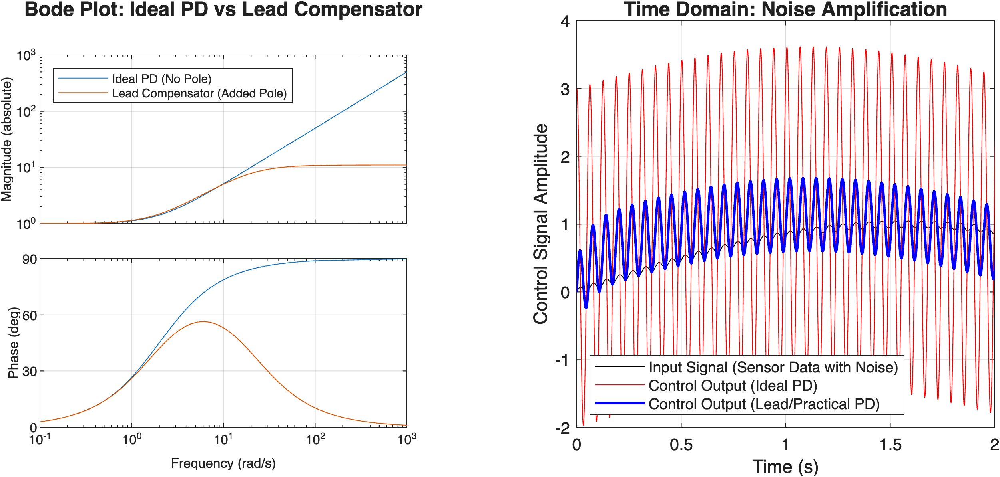

# 🚨 순수 미분제어(D)의 고주파 노이즈 증폭 문제와 Lead 보상기(극점 추가)를 통한 해결

제어공학을 배우는 학생들이 가장 헷갈려하는 부분 중 하나는 **"왜 이론적으로 완벽해 보이는 순수 PID 제어기를 실제 산업 현장에서는 그대로 쓰지 못하는가?"** 입니다. 이 문서에서는 미분항(D)이 가진 치명적인 단점과, 이를 극복하기 위해 극점(Pole)을 추가하는 우아한 수학적 해결책을 다룹니다.

---

## 1. 수식으로 보는 미분항의 '노이즈 증폭' 현상

센서에서 측정되는 실제 오차 신호 $e(t)$에는 항상 고주파의 자잘한 노이즈가 섞여 있습니다. 
예를 들어, 진짜 신호(저주파)에 진폭이 아주 작은 5%의 고주파 노이즈가 섞여 있다고 가정해 봅시다.

$$
e(t) = \underbrace{\sin(t)}_{\text{진짜 신호}} + \underbrace{0.05 \sin(100t)}_{\text{고주파 노이즈}}
$$

이를 순수 미분기(Ideal Derivative, $K_d \frac{d}{dt}$)에 통과시키면 어떻게 될까요?

$$
\frac{de(t)}{dt} = \cos(t) + 0.05 \times 100 \cos(100t)
$$

$$
\frac{de(t)}{dt} = \cos(t) + \mathbf{5 \cos(100t)}
$$

**충격적인 결과:** 원본 신호에서는 5%밖에 안 되던 찌끄러기 노이즈가, 미분을 거치자 **진짜 신호보다 5배나 더 큰 거대한 신호로 증폭**되어 버렸습니다! 이렇게 되면 액추에이터(모터 등)는 노이즈에 반응해 미친 듯이 덜덜 떨리게 되고, 결국 고장이 나게 됩니다.

---

## 2. 수학적 해결책: 극점(Pole)의 추가 (Lead 보상기)

이 문제를 주파수 영역($s$ 도메인)에서 살펴봅시다.
* **순수 PD 제어기:**
  
$$
C_{PD}(s) = K_p + K_d s
$$
  
   * 주파수 $\omega$가 무한대($\infty$)로 갈수록 이득($|K_d j\omega|$)도 무한대로 발산합니다.

**해결책:** 분모에 **안정적인 극점(Pole, $\frac{1}{\tau s + 1}$)** 을 하나 추가하여, 고주파수 대역에서 이득이 무한대로 커지는 것을 막아버립니다. 이것이 바로 현업에서 사용하는 실용적인 PD 제어기이자, 본질적으로 **Lead 보상기(Lead Compensator)** 와 동일한 구조입니다.

* **Lead 보상기 (필터가 추가된 실용적 PD):**
  
$$
C_{Lead}(s) = K_p + \frac{K_d s}{\tau s + 1}
$$

**이 수식이 우아한 이유:**
1. **저주파($s \to 0$):** 분모가 $1$에 가까워지므로 원래 의도했던 순수 PD 제어기($K_p + K_d s$)와 똑같이 작동하여 시스템의 응답속도를 높여줍니다.
2. **고주파($s \to \infty$):** 분모의 $s$가 커지면서 이득이 무한대로 발산하지 않고 상수값($K_p + \frac{K_d}{\tau}$)에 머물러 고주파 노이즈를 효과적으로 차단합니다!

---

## 3. 주파수 영역 및 시간 영역 시뮬레이션 비교

### 💡 그래프 해석 (티칭 포인트)

**[왼쪽] 주파수 응답 (Bode Plot)**
* 파란색 선(Ideal PD): 주파수가 높아질수록 이득(Gain)이 하늘 끝까지 치솟습니다. (노이즈 증폭의 원인)
* 빨간색 선(Lead Compensator): 극점(Pole)이 추가된 덕분에, 특정 주파수 이상부터는 이득이 꺾이면서 수평을 유지합니다. (노이즈 차단막 형성)

**[오른쪽] 시간 영역 응답 (Time Domain Simulation)**
* 검은색 선(Input): 센서로 들어온 아주 미세한 노이즈가 낀 원본 오차 신호입니다.
* 빨간색 선(Ideal PD): 미세한 노이즈가 수십 배로 뻥튀기되어 제어 신호가 위아래로 심하게 요동칩니다. 이 신호가 모터로 들어가면 모터가 타버립니다.
* 파란색 선(Lead Compensator): 극점(Pole) 하나를 추가했을 뿐인데 노이즈가 말끔하게 걸러지며, 우리가 원래 원했던 부드럽고 안정적인 제어 신호를 만들어냅니다!

> [!NOTE]
> **"여러분이 튜닝하는 산업용 PID 제어기나 드론의 비행 제어기(FC) 내부에는 예외 없이 모두 저 파란색 선을 만들어주는 극점(Low-pass filter)이 D항에 기본적으로 숨어 있다"**
