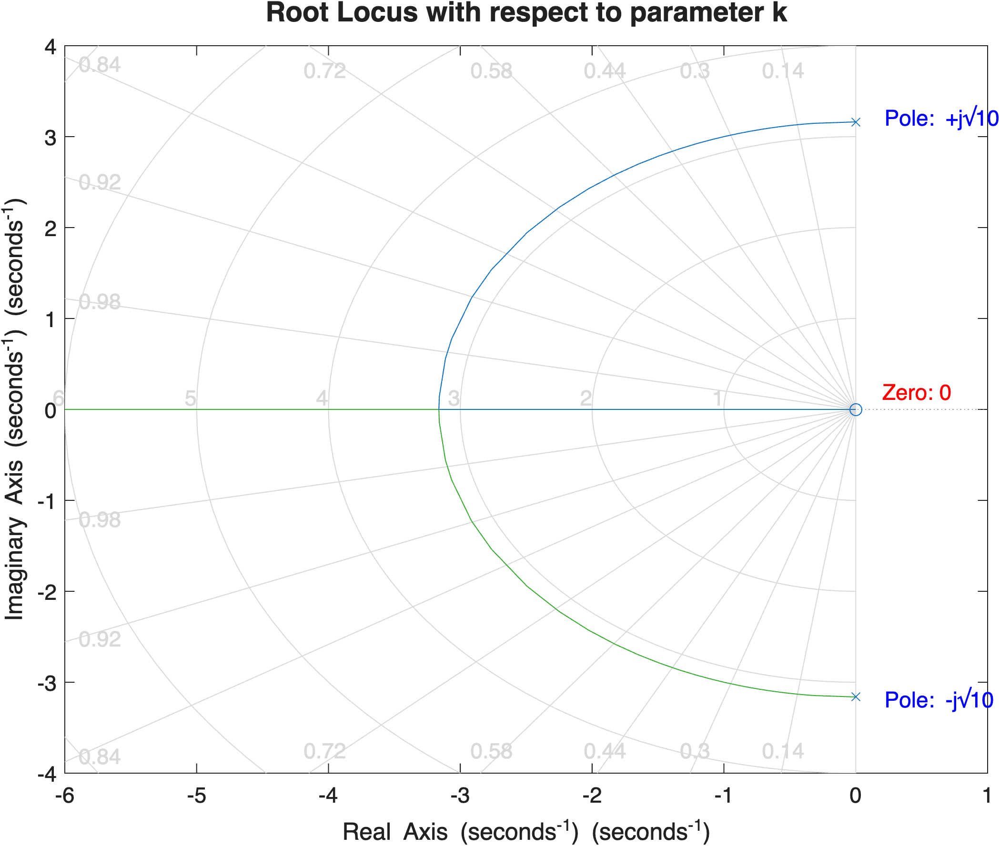

# 파라미터 k에 대한 근궤적(Root Locus) 분석

## 1. 개요
전달함수가 $G(s) = \frac{1}{s^2 + ks + 10}$ 로 주어졌을 때, 시스템의 내부 파라미터인 $k$의 변화에 따른 근궤적을 구하는 절차입니다. 보통 근궤적은 전체 개루프 이득 $K$에 대해 그리지만, 여기서는 $k$가 $0$에서 $\infty$로 변할 때 특성 방정식의 근(폐루프 극점)이 어떻게 이동하는지 분석합니다.

## 2. 수학적 변환 절차

근궤적을 그리기 위해서는 특성 방정식을 $1 + k \cdot L(s) = 0$ 의 표준 형태로 변환해야 합니다.

1. **특성 방정식 도출:**
   시스템 전달함수의 분모를 $0$으로 놓아 특성 방정식을 구합니다.
   $$ s^2 + ks + 10 = 0 $$

2. **$k$가 없는 항과 있는 항으로 분리:**
   $$ (s^2 + 10) + ks = 0 $$

3. **$k$가 없는 항으로 양변 나누기 ($1 + k L(s) = 0$ 형태 만들기):**
   양변을 $(s^2 + 10)$ 으로 나눕니다.
   $$ 1 + k \frac{s}{s^2 + 10} = 0 $$

4. **등가 개루프 전달함수 $L(s)$ 정의:**
   따라서 $k$ 변화에 대한 근궤적을 그리기 위한 가상의 개루프 전달함수 $L(s)$는 다음과 같이 정의됩니다.
   $$ L(s) = \frac{s}{s^2 + 10} $$
   - **영점(Zeros):** $s = 0$ (1개)
   - **극점(Poles):** $s = \pm j\sqrt{10} \approx \pm j3.162$ (2개)

## 3. 매트랩 코드 (MATLAB Code)
이 등가 전달함수 $L(s)$를 이용하여 MATLAB의 `rlocus()` 함수를 호출하면 $k$에 대한 근궤적을 그릴 수 있습니다.

```matlab
% Parameter k Root Locus Analysis
% Characteristic equation: s^2 + k*s + 10 = 0

s = tf('s');

% 1. Convert characteristic equation to standard root locus form
% s^2 + 10 + k*s = 0
% 1 + k * (s / (s^2 + 10)) = 0
% Therefore, the equivalent open-loop transfer function L(s) is:
L = s / (s^2 + 10);

% 2. Plot the Root Locus
figure('Position', [100, 100, 800, 600]);
rlocus(L);

% Set formatting for better visualization
title('Root Locus with respect to parameter k', 'FontSize', 14, 'FontWeight', 'bold');
xlabel('Real Axis (seconds^{-1})', 'FontSize', 12);
ylabel('Imaginary Axis (seconds^{-1})', 'FontSize', 12);
grid on;

% Add annotations for the poles and zeros
text(0.2, 3.2, 'Pole: +j\surd10', 'FontSize', 11, 'Color', 'b');
text(0.2, -3.2, 'Pole: -j\surd10', 'FontSize', 11, 'Color', 'b');
text(0.2, 0.2, 'Zero: 0', 'FontSize', 11, 'Color', 'r');
```

## 4. 근궤적 분석 결과



> [!TIP]
> **💡 그래프 해석 (티칭 포인트)**
> * **출발점 ($k=0$):** 궤적은 복소 극점인 $\pm j\sqrt{10}$ (허수축 위)에서 출발합니다. 즉, $k=0$일 때는 감쇠가 전혀 없는 순수 진동 상태(Undamped)입니다.
> * **이동 경로 ($k > 0$):** $k$가 증가함에 따라 두 극점은 허수축을 떠나 좌반면(Left-Half Plane)으로 진입하며 원을 그리듯 이동합니다. 이는 시스템이 점차 안정화되며 진동이 줄어듦(Underdamped)을 의미합니다.
> * **만나는 점 (Break-in Point):** 두 궤적은 실수축의 특정 지점에서 만나게 되며, 이 순간 시스템은 임계 감쇠(Critically Damped) 상태가 됩니다.
> * **도착점 ($k \to \infty$):** 하나는 실수축을 따라 영점인 원점($s=0$)으로 이동하고, 다른 하나는 음의 실수축을 따라 $-\infty$로 발산하게 됩니다 (Overdamped 상태로 전환).
