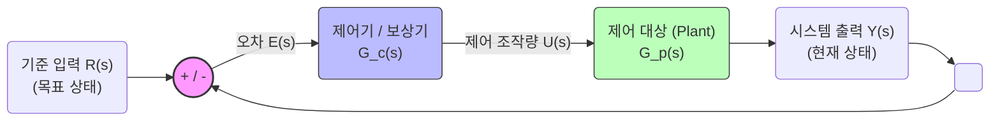

# [자동제어 강의 보조 교안] 피드백 제어, PID, 주파수 해석 및 Lead-Lag 보상기 설계

이 교안은 대학 학부 수준의 **자동제어(Automatic Control)** 강의에서 피드백 제어 시스템의 핵심 개념을 직관적이고 수치적으로 전달하기 위해 개발된 강의 보조 자료입니다. 하나의 연속적인 물리적 시스템(3차 플랜트)을 설정하고, 이를 다양한 제어 기법을 통해 안정화 및 성능 개선하는 과정을 시뮬레이션 그래프와 수학적 증명을 곁들여 단계별로 설명합니다.

---

## 1. 전체 시스템 구성 및 블록도 (System Configuration)

피드백 제어 시스템의 전체적인 블록도(Block Diagram)는 아래와 같이 구성되며, 각 부분은 목표 상태와 현재 출력의 차이(오차)를 바탕으로 동작합니다.

### 각 구성 블록(Block)의 상세 설명

1. **기준 입력 (Reference Input, $R(s)$)**: 
   시스템이 도달하고자 하는 최종 목표 상태입니다. 위치 제어에서는 목표 각도/위치, 온도 제어에서는 목표 온도가 되며, 교안에서는 과도 특성을 설명하기 위한 **단위 계단 입력(Unit Step, $1/s$)**과 정상상태 성능을 설명하기 위한 **단위 경사 입력(Unit Ramp, $1/s^2$)**을 사용합니다.
2. **합산점/비교기 (Summing Junction / Comparator)**:
   목표 입력 $R(s)$와 현재 출력 $Y(s)$를 비교하여 **제어 오차 $E(s) = R(s) - Y(s)$**를 실시간으로 연산합니다.
3. **제어기 및 보상기 (Controller / Compensator, $G_c(s)$)**:
   오차 $E(s)$를 감지하여 플랜트를 적절히 구동하기 위한 조작량(제어 입력) $U(s)$를 결정하는 두뇌에 해당합니다. 
   - **PID 제어기**: 비례(P), 적분(I), 미분(D) 연산의 조합으로 제어 신호를 생성합니다.
   - **Lead-Lag 보상기**: 주파수 영역에서 위상을 진행(Lead)시키거나 저주파 이득을 증가(Lag)시키는 Pole-Zero 조합 필터입니다.
4. **제어 대상 플랜트 (Plant, $G_p(s)$)**:
   제어 대상이 되는 물리적 시스템입니다. 본 교안에서는 주파수 영역과 시간 영역 안정성의 완벽한 일치를 설명하기 위해 다음 **3차 시스템**을 사용합니다.
   $$G_p(s) = \frac{10}{s(s+1)(s+4)} = \frac{10}{s^3 + 5s^2 + 4s}$$
   - **적분기($1/s$)**가 포함되어 있어 개루프 상태에서 원점에 극점이 있어 **마진 안정(Marginally Stable)** 상태입니다.
   - 극점이 $s = 0, -1, -4$에 위치하여, 단순 Proportional 이득이 조금만 증가해도 시스템이 쉽게 불안정해집니다.
5. **피드백 경로 (Feedback Path)**:
   출력 변수 $Y(s)$를 센서를 통해 계측하여 입력단으로 되돌리는 경로입니다. 본 교안은 이상적인 센서 조건인 **단위 피드백(Unity Feedback, $H(s)=1$)**을 전제합니다.

---

## 2. [강의 주제 1] 피드백과 PID 제어, 시간 영역 성능 평가

시간 영역 성능 평가는 제어 시스템의 응답 속도와 정확성을 평가하는 필수적인 척도입니다. 

### 시간 영역 주요 성능 지표 정의
* **상승 시간 (Rise Time, $t_r$)**: 응답이 최종값의 10%에서 90%까지 도달하는 데 걸리는 시간. (응답의 신속성 지표)
* **최대 오버슈트 (Peak Overshoot, $M_p$)**: 응답의 최댓값이 최종 정상상태 값을 초과하는 비율(%). (시스템의 감쇠/안정성 지표)
* **정착 시간 (Settling Time, $t_s$)**: 응답이 최종값의 $\pm 2\%$ 이내의 오차 범위에 들어와 완전히 정착하는 데 걸리는 시간. (과도 진동 소멸 속도)
* **정상상태 오차 (Steady-state Error, $e_{ss}$)**: 시간이 무한대로 갈 때 목표값과 출력값의 차이 ($t \to \infty$).

---

### (1) 비례 제어(P Control)와 안정성 경계 이론

단순 비례 제어 $G_c(s) = K_p$를 적용할 때, 폐루프 시스템의 전달 함수는 다음과 같습니다.
$$T(s) = \frac{K_p G_p(s)}{1 + K_p G_p(s)} = \frac{10K_p}{s^3 + 5s^2 + 4s + 10K_p}$$

이 폐루프 시스템의 안정성은 **루스-허위츠(Routh-Hurwitz) 안정성 판별법**을 통해 증명할 수 있습니다.
* 특성 방정식: $s^3 + 5s^2 + 4s + 10K_p = 0$
* 루스 배열(Routh Array) 작성:
  $$\begin{array}{c|cc}
  s^3 & 1 & 4 \\
  s^2 & 5 & 10K_p \\
  s^1 & \frac{5 \times 4 - 10K_p}{5} = 4 - 2K_p & 0 \\
  s^0 & 10K_p &
  \end{array}$$

시스템이 안정하려면 루스 배열의 1열 원소들이 모두 양수여야 합니다.
1. $10K_p > 0 \implies K_p > 0$
2. $4 - 2K_p > 0 \implies K_p < 2.0$

> [!IMPORTANT]
> **P 제어 안정성 결론:** 
> * $0 < K_p < 2.0$ 이면 시스템은 **안정(Stable)**합니다.
> * $K_p = 2.0$ 이면 특성 방정식의 근이 허수축($s = \pm j2$)에 위치하며 **임계 안정(Marginally Stable)** 상태가 되어 **지속 진동**합니다.
> * $K_p > 2.0$ 이면 극점이 우반평면(RHP)으로 넘어가 출력값이 지수적으로 발산하는 **불안정(Unstable)** 상태가 됩니다.

---

### (2) PI 및 PID 제어기의 도입과 효과

* **PI 제어기** ($G_c(s) = K_p + \frac{K_i}{s}$):
  - **적분 제어(I)**는 루프 전달 함수의 **시스템 타입(Type)을 1단계 올리는 역할**을 합니다. 원래 플랜트가 램프 입력에 대해 유한한 정상상태 오차($e_{ss} = 0.8$)를 가졌으나, PI를 적용하면 시스템 타입이 2(Type 2)가 되어 **정상상태 램프 오차를 이론적으로 0**으로 만듭니다.
  - 단점: 적분기는 위상 지연(Phase Lag)을 유발하므로 과도 영역에서 오버슈트가 극적으로 커지고($35.25\% \to 88.14\%$) 정착 시간도 크게 늘어납니다.
* **PID 제어기** ($G_c(s) = K_p + \frac{K_i}{s} + K_d s$):
  - **미분 제어(D)**는 시스템에 **LHP 영점(Zero)을 추가하는 효과**를 냅니다. 이 영점은 근궤적을 좌반평면 깊숙이 잡아끌어 제어계에 강력한 **댐핑(Damping)**을 주게 됩니다.
  - 결과적으로 PI 제어기에서 악화되었던 오버슈트를 억제하고 정착 시간을 크게 줄여주어, 신속성과 정확성을 동시에 확보합니다.

### 📊 시뮬레이션 결과 데이터 비교 (Step & Ramp Input)

| 제어기 유형 | 상승 시간 ($t_r$) | 최대 오버슈트 ($M_p$) | 정착 시간 ($t_s$) | 계단 정상상태 오차 | 경사(Ramp) 정상상태 오차 |
| :--- | :---: | :---: | :---: | :---: | :---: |
| **미보상 P제어** ($K_p=0.5$) | $1.30\text{ s}$ | $35.25\%$ | $10.68\text{ s}$ | $0.00$ | $0.80$ (이론치 $0.80$) |
| **PI 제어** ($K_p=0.5, K_i=0.2$) | $1.07\text{ s}$ | $88.14\%$ | $39.60\text{ s}$ | $0.00$ | $0.00$ (지수적 수렴) |
| **PID 제어** ($K_p=1.5, K_i=0.5, K_d=1$) | **$0.51\text{ s}$** | **$27.73\%$** | **$4.56\text{ s}$** | **$0.00$** | **$0.00$** (즉시 제거) |

> [!TIP]
> 학생들에게 오른쪽 그래프를 보여주며 **미분항(D)이 추가될 때의 감쇠 효과(진동 억제)와 적분항(I)이 추가될 때의 정상상태 정확도 향상**을 연계해서 설명하면 효과적입니다.

*실습용 MATLAB 코드 링크:* [control_demo_1_pid.m](file:///Users/donghankim/Library/CloudStorage/GoogleDrive-donghani@gmail.com/내 드라이브/Project/MCP examples/control_demo_1_pid.m)

---

## 3. [강의 주제 2] 주파수 영역의 성능평가 및 안정성 해석

주파수 영역 분석은 시스템의 개루프(Open-loop) 주파수 특성을 바탕으로 폐루프(Closed-loop)의 안정성과 응답 속도를 예측하는 획기적인 도구입니다.

### 주파수 영역 주요 지표 정의
* **이득 여유 (Gain Margin, GM)**: 위상이 $-180^\circ$가 되는 주파수(위상 교차 주파수, $\omega_{pc}$)에서 개루프 크기 $|G(j\omega)|$의 역수. 이득을 얼마나 더 키우면 불안정해지는가에 대한 척도 (dB 단위).
* **위상 여유 (Phase Margin, PM)**: 개루프 크기가 $1$ ($0\text{ dB}$)이 되는 주파수(이득 교차 주파수, $\omega_{gc}$)에서 위상각이 $-180^\circ$에 대해 가지는 추가적인 각도 여유.
* **대역폭 (Bandwidth, $\omega_{BW}$)**: 폐루프 크기 응답이 저주파 이득보다 $-3\text{ dB}$ 만큼 떨어지는 지점의 주파수. 응답 속도와 차단 특성을 결정함.
* **공진 피크 (Resonant Peak, $M_{p\omega}$)**: 폐루프 크기 주파수 응답의 최댓값. 시간 영역의 오버슈트($M_p$)와 비례 관계에 있음.

---

### (1) 근궤적법 (Root Locus)의 물리적 해석

근궤적법은 이득 $K$가 0에서 무한대로 변할 때 특성 방정식의 근(폐루프 극점)이 어떻게 복소 평면 위를 이동하는지 보여줍니다.

* **극점의 출발과 도착**: 근궤적은 개루프 극점 $s = 0, -1, -4$에서 출발하여 영점이 없으므로 점근선 각도 $\theta = \pm 60^\circ, 180^\circ$를 따라 무한대로 뻗어갑니다.
* **실수축 분기점 (Break-away Point)**: $s=0$과 $s=-1$ 사이에 존재하는 극점 두 개가 이득이 증가하면서 서로를 향해 다가오다 복소 평면으로 분기해 나갑니다.
* **허수축 교차점 (Imaginary Axis Crossing)**: 이탈한 두 지류가 우측으로 굽어지며 허수축인 $s = \pm j2$ 지점을 통과합니다. 이때의 임계 이득이 Routh-Hurwitz 증명대로 정확히 **$K_{crit} = 2.0$**이 됩니다.

---

### (2) 주파수 응답과 여유 분석 (Bode & Nyquist Plots)

보드 선도와 나이퀴스트 선도는 이 안정성 한계를 주파수 영역에서 입증합니다.

#### 보드 선도(Bode Plot) 해석 ($K_p = 0.5$ 적용 시):
* **위상 교차 주파수 ($\omega_{pc} = 2.0\text{ rad/s}$)**: 위상이 정확히 $-180^\circ$에 도달하는 주파수입니다.
* **이득 여유 ($GM = 12.04\text{ dB}$)**: $\omega_{pc} = 2.0$에서의 크기가 약 $-12\text{ dB}$이므로 이득 여유는 $12.04\text{ dB}$가 됩니다. 이득을 $12.04\text{ dB}$ (즉, 4배) 올리면 이득이 $0.5 \times 4 = 2.0$이 되어 이득 여유가 $0\text{ dB}$가 되고 시스템은 임계 안정이 됩니다.
* **이득 교차 주파수 ($\omega_{gc} = 0.90\text{ rad/s}$)**: 개루프 이득이 $0\text{ dB}$가 되는 지점입니다.
* **위상 여유 ($PM = 35.14^\circ$)**: $\omega_{gc} = 0.90$에서의 위상각은 $-144.86^\circ$로, $-180^\circ$보다 약 $35.14^\circ$의 위상 마진을 갖습니다.

#### 나이퀴스트 안정성 판별법 (Nyquist Stability Criterion):
* 특성 방정식 극점 수 식: $Z = N + P$
  - $P$: 개루프 우반평면(RHP) 극점 수. 우리 플랜트는 $s=0, -1, -4$이므로 RHP 극점이 없어 **$P = 0$**입니다.
  - $N$: 나이퀴스트 선도가 임계점 $(-1, j0)$을 시계방향으로 감싸는 횟수.
  - $Z$: 폐루프의 RHP 극점 수 (즉, $Z=0$이어야 안정).
* **안정 상태 ($K_p = 0.5$)**: 나이퀴스트 궤적이 $(-1, j0)$ 점의 오른쪽에 위치하여 감싸지 않습니다 ($N = 0$). 따라서 $Z = 0 + 0 = 0$으로 **안정**합니다.
* **불안정 상태 ($K_p = 3.0$)**: 나이퀴스트 궤적이 확장되어 $(-1, j0)$ 점을 시계 방향으로 2회 감싸게 됩니다 ($N = 2$). 따라서 $Z = 2 + 0 = 2$가 되어 **우반평면에 2개의 unstable 극점이 생기고 시스템은 불안정**해집니다.

*실습용 MATLAB 코드 링크:* [control_demo_2_analysis.m](file:///Users/donghankim/Library/CloudStorage/GoogleDrive-donghani@gmail.com/내 드라이브/Project/MCP examples/control_demo_2_analysis.m)

---

## 4. [강의 주제 3] Lead-Lag 보상기 설계 및 종합 개선

제어계의 설계 목적은 대개 **"더 빠르게 정착하고(과도응답 개선), 정상상태 오차는 최소화(정밀도 개선)하는 것"**입니다. 이를 위해 Lead-Lag 보상기를 설계합니다.

### 보상기 설계 원리

1. **리드(진상) 보상기 (Lead Compensator)**:
   $$G_{lead}(s) = K_c \frac{s + z_{lead}}{s + p_{lead}} \quad (z_{lead} < p_{lead})$$
   - **위상 앞섬 기능**: 특정 주파수 영역에서 양(+)의 위상을 추가하여 위상 여유(PM)를 향상시킵니다. 이는 시간 영역에서 댐핑을 부여하여 **오버슈트를 드라마틱하게 줄이고 정착 시간을 대폭 단축**시킵니다.
   - 본 설계: $G_{lead}(s) = 3 \cdot \frac{s + 1.2}{s + 4.8}$ (최대 위상 진행 약 $37^\circ$ 추가)
2. **래그(지상) 보상기 (Lag Compensator)**:
   $$G_{lag}(s) = \frac{s + z_{lag}}{s + p_{lag}} \quad (z_{lag} > p_{lag})$$
   - **저주파 이득 향상**: 아주 낮은 주파수 대역(원점 근처)에 극점과 영점을 밀접하게 배치하여, 고주파 Crossover 부근의 위상 마진은 거의 해치지 않으면서 **저주파 영역의 이득만 선택적으로 증폭(5배)**시킵니다. 이를 통해 **정상상태 경사 오차를 혁신적으로 줄입니다**.
   - 본 설계: $G_{lag}(s) = \frac{s + 0.1}{s + 0.02}$ (저주파 이득 5배 증가, $\beta = 0.2$)

---

### 📊 미보상 vs Lead 보상 vs Lead-Lag 보상 최종 성능 비교

| 설계 단계 | 위상 여유 ($PM$) | 이득 여유 ($GM$) | 상승 시간 ($t_r$) | 최대 오버슈트 ($M_p$) | 정착 시간 ($t_s$) | 정상상태 램프 오차 |
| :--- | :---: | :---: | :---: | :---: | :---: | :---: |
| **(1) 미보상 P제어** | $16.77^\circ$ | $6.02\text{ dB}$ | $0.83\text{ s}$ | $61.96\%$ | $19.71\text{ s}$ | $0.40$ (매우 큼) |
| **(2) Lead 보상기** | **$47.33^\circ$** | **$14.14\text{ dB}$** | $0.78\text{ s}$ | **$21.48\%$** | **$4.23\text{ s}$** | $0.53$ |
| **(3) Lead-Lag 보상기**| **$44.21^\circ$** | **$13.79\text{ dB}$** | **$0.75\text{ s}$** | **$27.56\%$** | **$7.30\text{ s}$** | **$0.13$** (약 70% 감소) |

### 성능 개선 포인트 요약 설명
* **P 제어 상태**에서는 위상 여유가 $16.77^\circ$ 밖에 되지 않아 출렁임(오버슈트 $61.96\%$)이 매우 심하고 불안정합니다.
* **Lead 보상기 도입 후**, 위상 여유가 $47.33^\circ$로 대폭 확보되며 진동이 급격히 사라지고 오버슈트가 $21\%$ 수준으로 억제되며 정착 시간이 **$19.71\text{ s}$에서 $4.23\text{ s}$로 약 80% 가까이 단축**됩니다.
* **Lag 보상기까지 결합(Lead-Lag)**하면, 뛰어난 과도 성능(속도 및 댐핑)을 그대로 유지하면서, 정상상태 램프 에러를 **$0.53$에서 $0.13$으로 극적으로 낮추는 쾌거**를 이루게 됩니다.

*실습용 MATLAB 코드 링크:* [control_demo_3_compensator.m](file:///Users/donghankim/Library/CloudStorage/GoogleDrive-donghani@gmail.com/내 드라이브/Project/MCP examples/control_demo_3_compensator.m)

---

## 5. 결론 및 수업 활용 가이드

교수님께서는 본 예제 패키지와 저장된 이미지들을 다음과 같이 활용하실 수 있습니다:

1. **개념 도입 단계**: P 제어의 안정성 한계를 Routh-Hurwitz 계산과 대조하며 `control_demo_1_pid.m`을 실행해 $K_p=2.0$의 지속진동과 $K_p=3.0$의 발산을 실제로 목격시킵니다.
2. **분석 단계**: 근궤적의 RHP 돌입 주파수가 Bode/Nyquist의 위상교차주파수($\omega = 2.0\text{ rad/s}$)와 일치하는 유기적 맥락을 주파수 분석 그래프를 활용해 시각화해 줍니다.
3. **설계 실습 단계**: 학생들이 직접 MATLAB 상에서 Lead 보상기의 극점/영점 위치($z_{lead}, p_{lead}$)를 변경해 가며 위상 여유가 어떻게 변화하고 계단 응답 속도가 조절되는지 설계 튜닝을 체험하도록 안내합니다.
